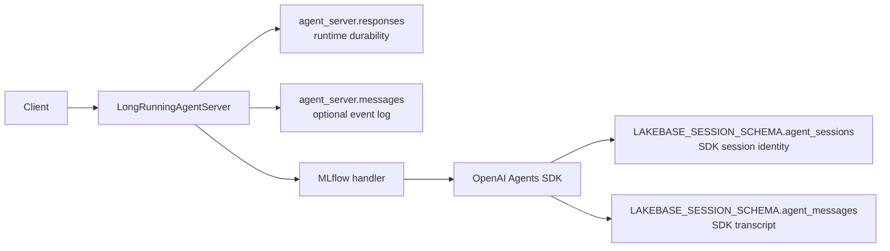

# OpenAI SDK Recovery Modes

These three Databricks Apps run the same OpenAI Agents SDK PR-review agent and
expose the same MLflow `@invoke()` / `@stream()` surface. The mode-specific
handler code is intentionally visible, while only two `LongRunningAgentServer`
options change:

| App | `auto_recovery` | `sse_replay` | Resume input | Durable event rows |
| --- | --- | --- | --- | --- |
| [`framework_recovery_sse/`](./framework_recovery_sse/) | `True` | `True` | Original request plus prose built from prior stream events; rotated SDK session | Yes |
| [`agent_recovery_sse/`](./agent_recovery_sse/) | `False` | `True` | Fixed recovery prompt; same SDK session restores its transcript | Yes, for client replay only |
| [`agent_recovery_polling/`](./agent_recovery_polling/) | `False` | `False` | Fixed recovery prompt; same SDK session restores its transcript | No |

Heartbeat, stale-attempt claiming, and process-start recovery run in all three
modes. `auto_recovery` controls who restores agent context, not whether a stale
attempt is restarted.

Framework-managed recovery requires a registered `@stream()` handler because
its recovery prompt is built from persisted progress events. The client may
still send `stream=false`: the server executes `@stream()` internally and
returns a response ID for polling. `sse_replay` controls whether those events
are exposed to clients, independently of whether recovery persists them.

## Staging deployments

All three examples are deployed in `ml-inference-staging` against separate
branches of the `shivam-openai-agent-on-apps` Lakebase project:

| App | Runtime | Workspace | Lakebase tables |
| --- | --- | --- | --- |
| Framework recovery + SSE | [App](https://openai-agent-framework-sse-1653573648247579.staging.aws.databricksapps.com) | [Overview](https://eng-ml-inference.staging.cloud.databricks.com/apps-v2/app/openai-agent-framework-sse/overview?o=1653573648247579) | [`durable-framework-sse`](https://eng-ml-inference.staging.cloud.databricks.com/lakebase/projects/18e258e0-0c3c-4cf4-aa99-c5a8452b25ef/branches/br-falling-rice-y2moig3m/tables) |
| Agent recovery + SSE | [App](https://openai-agent-session-sse-1653573648247579.staging.aws.databricksapps.com) | [Overview](https://eng-ml-inference.staging.cloud.databricks.com/apps-v2/app/openai-agent-session-sse/overview?o=1653573648247579) | [`durable-session-sse`](https://eng-ml-inference.staging.cloud.databricks.com/lakebase/projects/18e258e0-0c3c-4cf4-aa99-c5a8452b25ef/branches/br-withered-snow-y24p21r1/tables) |
| Agent recovery + polling | [App](https://openai-agent-session-poll-1653573648247579.staging.aws.databricksapps.com) | [Overview](https://eng-ml-inference.staging.cloud.databricks.com/apps-v2/app/openai-agent-session-poll/overview?o=1653573648247579) | [`durable-session-poll`](https://eng-ml-inference.staging.cloud.databricks.com/lakebase/projects/18e258e0-0c3c-4cf4-aa99-c5a8452b25ef/branches/br-damp-mountain-y2yvlah2/tables) |

```text
openai-sdk-agent/
├── framework_recovery_sse/   # app.py + app.yaml + handlers.py
├── agent_recovery_sse/       # app.py + app.yaml + handlers.py
├── agent_recovery_polling/   # app.py + app.yaml + handlers.py
└── shared/                   # only the identical agent loop and SDK sessions
```

The mode folders intentionally duplicate `app.py` and `handlers.py`. This is a
developer-experience comparison, so each folder shows the complete server
configuration and handler code an author owns instead of hiding the differences
behind a shared factory.

Detailed deployed test evidence is recorded per app:

- [Framework recovery with SSE replay](./framework_recovery_sse/TEST_RESULTS.md)
- [Agent recovery with SSE replay](./agent_recovery_sse/TEST_RESULTS.md)
- [Agent recovery with polling](./agent_recovery_polling/TEST_RESULTS.md)

## Recovery hook

After atomically claiming a stale attempt, `LongRunningAgentServer` calls the
single function registered with `@on_resume()`. The callback transforms the
stored request; the server then invokes the persisted execution-handler mode.
Framework-managed recovery always persists and reuses `@stream()`, including
when the client polls. Agent-managed recovery follows the client's invoke or
stream mode. Authors do not register separate resume callbacks. This is the
recovery translation boundary: after the callback returns, the transformed
request is an ordinary handler request.

Each `handlers.py` includes a commented, copyable implementation of its full
default transformation. The shorter equivalent is:

```python
from databricks_ai_bridge.long_running import ResumeContext, on_resume


@on_resume()
async def resume_request(request, context: ResumeContext):
    return await context.default_request(request)
```

`ResumeContext` exposes the response ID, current and previous attempt numbers,
the previous attempt's persisted events, and `default_request()`. When no
`@on_resume()` function is registered, the server calls that same default
automatically.

The built-in implementation has two policies:

```python
LongRunningAgentServer(auto_recovery=True)
# Build [RECOVERY] prose from the prior attempt's event log and rotate the
# conversation ID so the handler opens a clean SDK session.

LongRunningAgentServer(auto_recovery=False)
# Keep the original session ID and replace request.input with one fixed
# [RECOVERY] prompt. The agent SDK session store supplies the transcript.
```

Applications register `@on_resume()` only when they need another request
contract. Session restoration still happens later, when the resumed
execution handler opens its SDK session. Framework recovery always uses
`@stream()`; agent-managed recovery uses the client-selected handler.

### Stable session anchor

Agent-managed recovery needs a stable session anchor internally. A client may
provide `context.conversation_id`, `custom_inputs.session_id`, or
`custom_inputs.thread_id`. If none is present, the server logs a warning and
injects its generated `response_id` as `context.conversation_id` before the
request is persisted or dispatched. The request therefore continues instead
of failing validation.

The runtime `response_id` and agent SDK `session_id` remain different logical
identities. They use the same string only for this generated fallback. An
explicit client-provided anchor is useful when the client must know or reuse the
SDK session identity before it receives the background response.

The anchor is persisted inside `agent_server.responses.original_request`, not
as a dedicated runtime-table column. On recovery, `@on_resume()` translates
the stored request into a normal request while retaining that anchor. The same
ordinary `@invoke()` or `@stream()` handler then opens the SDK session; it does
not know whether the request is an initial attempt or a resumed attempt.

## Logical and physical persistence

There are three independent logical stores. They share a Lakebase branch in
each example, but they do not have the same owner or purpose:



1. **Runtime durability:** `agent_server.responses` is owned by
   `LongRunningAgentServer`. It stores the original request, terminal response,
   status, heartbeat, attempt, and whether the background executor uses the
   stream handler.
2. **Durable event log:** `agent_server.messages` is also runtime-owned, but is
   a separate append-only stream-event/output-item log. It is written only when
   framework recovery or client SSE replay needs events.
3. **Agent session store:** this is the actual conversation store selected by
   the agent handler/harness. In these examples, the OpenAI Agents SDK owns
   `agent_sessions` and `agent_messages` in `LAKEBASE_SESSION_SCHEMA`. The
   handler opens this store; `LongRunningAgentServer` neither creates its schema
   nor parses its transcript.

The physical schema captured from all three deployed Lakebase branches is:

| Table | Primary key | Captured columns and PostgreSQL types |
| --- | --- | --- |
| `agent_server.responses` | `response_id` | `response_id text`, `status text`, `created_at timestamptz`, `trace_id text?`, `heartbeat_at timestamptz?`, `attempt_number int`, `original_request text?`, `response text?`, `is_streaming boolean` |
| `agent_server.messages` | `(response_id, sequence_number)` | `response_id text`, `sequence_number int`, `attempt_number int`, `item text?`, `stream_event text?` |
| `<SDK schema>.agent_sessions` | `session_id` | `session_id varchar`, `created_at timestamp`, `updated_at timestamp` |
| `<SDK schema>.agent_messages` | `id` | `id int`, `session_id varchar`, `message_data text`, `created_at timestamp` |

`?` marks a nullable column. `original_request`, `response`, `item`,
`stream_event`, and `message_data` contain serialized JSON text.

`agent_messages.session_id` references the SDK-owned session identity. There is
no foreign key between the SDK schema and `agent_server`: the request's session
or conversation ID is the logical correlation key.

### Per-mode writes

| App | Runtime response | Event log | SDK session behavior |
| --- | --- | --- | --- |
| Framework recovery + SSE | Request and terminal response always stored | Stored; read for recovery and SSE replay | Crashed session is left as-is; resume writes a rotated `::attempt-N` session |
| Agent recovery + SSE | Request and terminal response always stored | Stored only for SSE replay | Resume reopens the same SDK session and uses its transcript |
| Agent recovery + polling | Request and terminal response always stored | Table exists but receives no rows | Resume reopens the same SDK session and uses its transcript |

Each mode README includes a captured response row plus its event and SDK-session
counts from the deployed app.

### Event-log condition

The server writes `agent_server.messages` only when at least one consumer needs
the event log:

```text
event_log_enabled = auto_recovery or sse_replay
```

- Framework-managed recovery reads prior events to construct recovery prose.
- SSE replay reads events for `starting_after` cursor recovery.
- When both options are false, the messages table remains available for schema
  compatibility but receives no rows for that response.

Polling does not depend on event rows. Every terminal Responses payload is
stored in `agent_server.responses.response`, alongside status, attempt,
heartbeat, and original request.

The SDK transcript is independent:

| Owner | Schema | Purpose |
| --- | --- | --- |
| `LongRunningAgentServer` | `agent_server.responses` | Request, final response, handler mode, heartbeat, attempt, status |
| `LongRunningAgentServer` | `agent_server.messages` | Optional stream-event log |
| OpenAI Agents SDK | `LAKEBASE_SESSION_SCHEMA.agent_sessions` | SDK session identity and timestamps |
| OpenAI Agents SDK | `LAKEBASE_SESSION_SCHEMA.agent_messages` | User, model, tool-call, and tool-output transcript |

## Shared agent code

- `shared/src/openai_sdk_agent_shared/review_agent.py` contains the identical
  deterministic PR CUJs and shell tool used by all three Apps.
- `shared/src/openai_sdk_agent_shared/sessions.py` creates the identical
  `AsyncDatabricksSession` instances used by all three Apps.
- Each mode folder owns `handlers.py`. Every invoke/stream handler follows one
  normal path for initial and resumed requests. Recovery-specific translation
  happens before dispatch in `@on_resume()` or its built-in default.
- Each mode folder owns `app.py`, which directly constructs
  `LongRunningAgentServer` with fixed `auto_recovery`/`sse_replay` values.
- Each `handlers.py` shows the optional `@on_resume()` override beside the
  ordinary MLflow handlers.

## HTTP tests

Use background streaming for either replay-enabled app:

```bash
curl -N -X POST "$APP_URL/responses" \
  -H "Authorization: Bearer $APP_TOKEN" \
  -H 'Content-Type: application/json' \
  -d '{
    "background": true,
    "stream": true,
    "input": [{"role": "user", "content": "Execute the complete PR CUJ."}],
    "custom_inputs": {
      "session_id": "framework-sse-test",
      "pr_url": "https://github.com/databricks/databricks-ai-bridge/pull/459",
      "minimum_minutes": 0
    }
  }'
```

Reconnect with the response ID and last observed sequence:

```bash
curl -N "$APP_URL/responses/$RESPONSE_ID?stream=true&starting_after=$LAST_SEQUENCE" \
  -H "Authorization: Bearer $APP_TOKEN"
```

Use background polling for the no-replay app:

```bash
curl -X POST "$APP_URL/responses" \
  -H "Authorization: Bearer $APP_TOKEN" \
  -H 'Content-Type: application/json' \
  -d '{
    "background": true,
    "input": [{"role": "user", "content": "Execute the complete PR CUJ."}],
    "custom_inputs": {
      "session_id": "agent-polling-test",
      "pr_url": "https://github.com/databricks/databricks-ai-bridge/pull/459",
      "minimum_minutes": 0
    }
  }'

curl "$APP_URL/responses/$RESPONSE_ID" \
  -H "Authorization: Bearer $APP_TOKEN"
```

`stream=true` is rejected for a background request or retrieval when
`sse_replay=False`.

## Deploy

The bundle defines all three Apps. Give each App its own Lakebase branch and
database resource. Every App service principal creates the fixed
`agent_server` schema, so sharing one branch would make the first principal the
schema owner and prevent the other two from initializing it. The SDK session
schemas are also separate.

Each mode folder is a standalone App source with its own `app.py`, `app.yaml`,
`requirements.txt`, and README. The shared implementation is packaged once and
installed into each App from a local wheel.

Build the unreleased server wheel and shared-agent wheel into all three App
sources before validation or deployment:

```bash
bash examples/openai-sdk-agent/prepare_deployment.sh
```

```bash
cd examples/openai-sdk-agent

bundle_vars=(
  --var="framework_recovery_sse_lakebase_branch=projects/<project>/branches/<framework-branch>"
  --var="framework_recovery_sse_lakebase_database=projects/<project>/branches/<framework-branch>/databases/<database>"
  --var="agent_recovery_sse_lakebase_branch=projects/<project>/branches/<agent-sse-branch>"
  --var="agent_recovery_sse_lakebase_database=projects/<project>/branches/<agent-sse-branch>/databases/<database>"
  --var="agent_recovery_polling_lakebase_branch=projects/<project>/branches/<agent-polling-branch>"
  --var="agent_recovery_polling_lakebase_database=projects/<project>/branches/<agent-polling-branch>/databases/<database>"
  --var="openai_secret_scope=<scope>"
  --var="openai_secret_key=<key>"
)

databricks bundle validate --profile <PROFILE> "${bundle_vars[@]}"
databricks bundle deploy --profile <PROFILE> "${bundle_vars[@]}"

databricks bundle run framework_recovery_sse --profile <PROFILE> "${bundle_vars[@]}"
databricks bundle run agent_recovery_sse --profile <PROFILE> "${bundle_vars[@]}"
databricks bundle run agent_recovery_polling --profile <PROFILE> "${bundle_vars[@]}"
```
