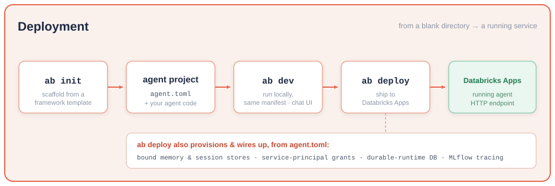
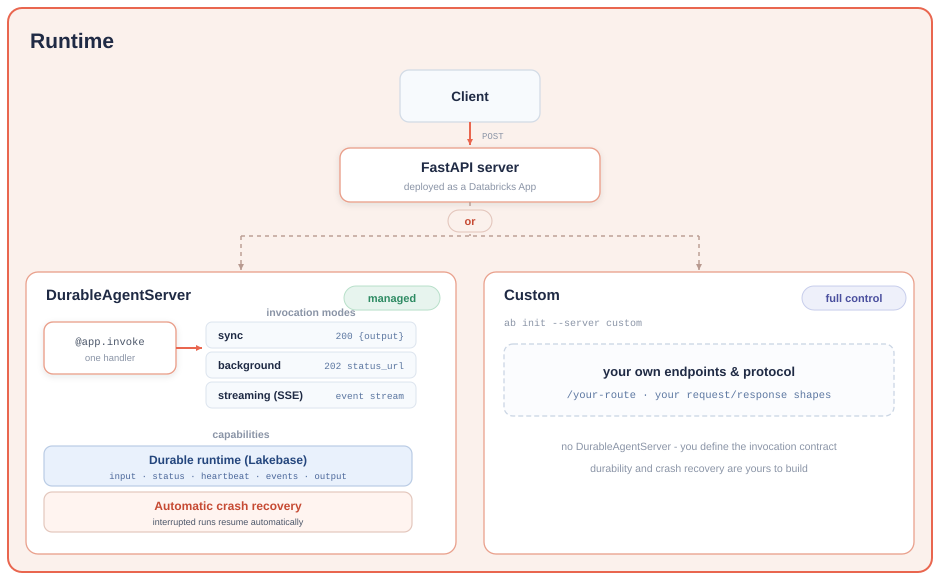
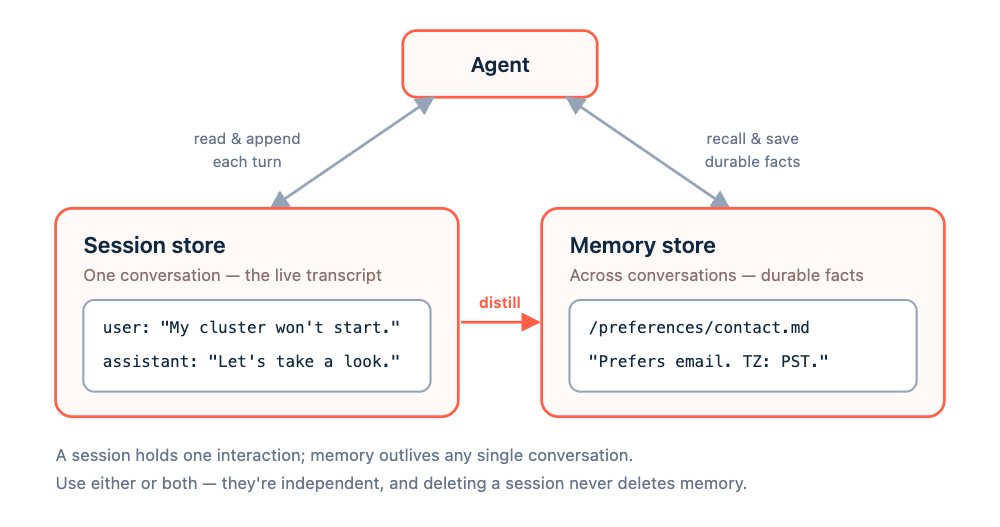

# Agent Bricks CLI (`ab`)

Agent Bricks CLI is an experimental command-line interface for building and deploying custom
agents on Databricks. It manages memory, sessions, tracing, and deployments from one authenticated
command.

> The underlying APIs are in preview and may need workspace enablement.

## Overview

A managed path from your custom agent code to a production-ready, scalable, durable agent hosted on
Databricks in minutes - with no server framework to build, no infrastructure to provision, and no
invocation protocol to design yourself. Bring your own agent, or start from a template.

- **Deployment** - a guided lifecycle (scaffold, run locally, deploy) that turns an agent project
  into a hosted endpoint. Databricks provisions the compute, the stores your agent binds (session,
  memory), and the access grants, so you ship application code and get a running endpoint.
- **Runtime** - a managed HTTP invocation contract (synchronous, streaming, background) plus optional
  durable execution (persistence, heartbeats, crash recovery) backed by Databricks Lakebase, with no
  database or job queue to operate. Use the opinionated `DurableAgentServer` to get it out of the box,
  or bring your own server for full control. `AgentApp` remains available as a deprecated
  compatibility alias; new code should use `DurableAgentServer`.

**Deployment**



- **Agent project** - `ab init` scaffolds a deployable project from a framework template
  (LangGraph or OpenAI Agents) with the runtime, tests, and an optional chat UI wired up; you edit
  the application code (model, tools, prompts).
- **`agent.toml`** - the declarative source of truth for the Databricks-managed infrastructure your
  agent depends on: tool bindings (data sandbox, managed MCP services, Unity Catalog functions) and
  memory, session, and durability resources. `ab deploy` reads it to provision and wire everything
  up (detailed under [Agent tools](#agent-tools)).
- **`ab deploy`** - provisions the bound stores, grants the app's service principal access to
  them, provisions the durable-runtime database when durability is on, configures tracing, and rolls
  out the app. `ab deployments` covers the lifecycle (list, get, logs, start, stop, delete).
- **`ab dev`** - runs your agent from the same manifest the deployment uses, so local behavior
  matches what ships.

**Runtime**



The two ways to run an agent:

- **`DurableAgentServer` - opinionated, batteries included.** Register one handler and get the managed
  invocation contract (synchronous, streaming, background). Enable the durable runtime so
  long-running and background work survives restarts, redeploys, and crashes. The framework
  templates are thin layers over `DurableAgentServer` (HTTP contract detailed under [Runtime](#runtime)).
- **Custom server - generic, full control.** `ab init --server custom` scaffolds a minimal FastAPI
  server with no `DurableAgentServer`: you define your own endpoints, request/response shapes, and protocol.
  `ab dev` and `ab deploy` run and ship it the same way.

## Prerequisites

- **Python ≥3.10** — the `ab` CLI installs and runs on any Python 3.10+. The
  `memory`, `sessions`, `tools`, and `ab tracing bind`/`unbind` commands need nothing else.
- **[`uv`](https://docs.astral.sh/uv/)** — needed to scaffold, run, and deploy an
  agent (`ab init` → `ab dev` → `ab deploy`): the scaffolded project builds
  its environment and launches with `uv run`, both locally and in the deployed Apps
  runtime. The store/session/tools commands and `ab tracing bind`/`unbind` don't need it;
  `ab tracing list`/`get` do, to read `ab dev`'s local trace store.
- **[Databricks CLI](https://docs.databricks.com/dev-tools/cli/)** — needed for
  browser-based `ab login`. If a profile is already authenticated, the CLI uses it
  directly and the Databricks CLI is optional.

## Installation

From PyPI:

The `databricks-agentbricks` Python distribution installs the `ab` command and AgentKit.

```sh
pip install databricks-agentbricks
```

From source:

```sh
pip install 'git+https://github.com/databricks/databricks-ai-bridge.git#subdirectory=integrations/agentbricks'
```

The base package includes the CLI, store SDK, and `DurableAgentServer` HTTP runtime. Generated projects
declare their framework dependencies automatically.

## Shell completion
Add this to `~/.zshrc`:
```sh
eval "$(_AB_COMPLETE=zsh_source ab)"
```

## Authentication

Agent Bricks CLI uses [Databricks authentication](https://docs.databricks.com/aws/en/dev-tools/cli/authentication).
Ask the CLI to authenticate and remember a named profile:

```sh
ab login --profile <profile>
ab sessions stores list
```

`ab login` validates existing credentials first. If credentials are missing or rejected in
an interactive terminal, the CLI runs `databricks auth login --profile <profile>`, revalidates the
profile, and stores the selection in the existing `~/.agentbricks/config.json` state file. This
browser-based setup requires the Databricks CLI. In non-interactive environments, authenticate the
profile before running `ab`. `ab logout` forgets the saved selection without revoking the underlying
credentials.

If Databricks SDK default authentication is already configured, you can skip `ab login`.
You can also pass the global `--profile/-p` option before an individual command, for example
`ab --profile <profile> tools list`. Use `--output json` for scripting.

## Quickstart

The shortest path from a blank directory to a running and deployed agent:

```sh
ab login --profile <profile>
ab init my-agent
cd my-agent
ab dev                 # run locally
ab deploy my-agent     # deploy to Databricks
```

`ab dev` runs the agent locally on `http://localhost:8000`, wrapping the Databricks Apps
local runtime so local behavior matches a deployment.

`ab deploy my-agent` deploys a Databricks App named `agent-bricks-my-agent`, provisions the
stores declared in `agent.toml`, and grants the app's service principal access to them. Use
`ab deployments list` to find deployed apps, and `ab deployments get agent-bricks-my-agent` to
print an app's URL and status.

`ab init` declares default memory and session stores in `agent.toml`, so the deployed agent has
long-term memory and durable conversation history. It creates `<name>-<6-letter-token>-memory` and
`<name>-<6-letter-token>-sessions`, and records both names in `agent.toml`.
`ab deploy` creates them if they don't exist yet. Point the agent at stores you already have with
`ab memory bind <name>` / `ab sessions bind <name>`, or scaffold without stores using
`ab init --server custom` (see [Initialize the chat app demo](#initialize-the-chat-app-demo)).

To exercise the agent (locally under `ab dev` or once deployed), `ab endpoint invoke` sends
it an HTTP request. MLflow tracing is on by default (`ab init` binds a default
`/Shared/agentbricks_traces/<project>` experiment): `ab dev` traces to a local MLflow server under
`.agentbricks/` and `ab deploy` to the bound workspace experiment; `ab tracing list` shows the
available traces.

## Public names

Use `ab` for the CLI and `AgentKitClient` from `databricks_agentkit` for the Python SDK. New
projects store local state under `.agentbricks/` and `~/.agentbricks/`, use
`server = "agentbricks"` in `agent.toml`, and deploy apps with the `agent-bricks-` prefix.

## AgentKit SDK

`AgentKitClient` adds a small resource-oriented layer over AgentKit APIs. Pass it an
authenticated Databricks `WorkspaceClient`, or omit the argument to use the
Databricks SDK's default authentication resolution:

```python
from databricks.sdk import WorkspaceClient
from databricks_agentkit import AgentKitClient

agentkit = AgentKitClient(WorkspaceClient(profile="my-workspace"))

session_store = agentkit.session_stores.create("support-agent-sessions")
session = session_store.add(actor_id="customer-123", session_id="case-456")
session.append_items(
    [
        {"type": "message", "role": "user", "content": "I need help with my cluster."},
        {"type": "message", "role": "assistant", "content": "Let's take a look."},
    ]
)

memory_store = agentkit.memory_stores.create("coding-agent-memory")
memory = memory_store.add(
    actor_id="alice",
    path="/preferences/style.md",
    content="The user prefers concise answers.",
)
results = memory_store.search(
    actor_id="alice",
    query="response preferences",
    limit=10,
)
memory = memory.update(content="The user prefers very concise answers.")
memory.delete()
```

The root collections manage stores: `agentkit.memory_stores.create/get/list` and
`agentkit.session_stores.create/get/list`. A returned store owns operations on its
contents, such as `memory_store.add()`, `memory_store.get("memory-id")`,
`memory_store.list()`, and `memory_store.search()`, or `session_store.add()`,
`session_store.get("session-id")`, and `session_store.list()`. Returned memories,
sessions, and stores own their `update()` and `delete()` operations.

All `list()` methods return iterators that automatically consume server pages. List
`page_size` and search `limit` values must be between 1 and 100. `session.list_items()`
also auto-pages. `session.fork(...)` creates an independent copy, optionally through
a specific item. Deleting a session with descendants requires
`session.delete(force=True)` to cascade the deletion.

The resource layer intentionally does not mirror every API method. Its private
transport will be replaced by the generated `WorkspaceClient.mason` service when that
is released, without changing this public surface. Deployment, sandbox, tracing, and
the existing CLI commands remain separate.

## Runtime

`DurableAgentServer` runs your agent through one HTTP API for synchronous, streaming, and background
invocations. Register an `@app.invoke` handler, publish progress with `await context.emit(event)`,
and return a JSON result. You can also add your own FastAPI endpoints.

Start from a template, edit the agent code in `agent/`, and run it locally before deploying:

```sh
ab init my-agent --framework langgraph --server agentbricks --profile <profile>
cd my-agent
ab dev
# Stop the local server when ready to deploy.
ab --profile <profile> deploy my-agent
```

Use `--framework openai` for OpenAI Agents. Templates keep agent code separate from the runtime
adapter and declare default Session and Memory Store bindings in `agent.toml`.

Each managed run is an **invocation**. Send a client-generated UUID `id` and your agent's `input`:

```json
{
  "id": "550e8400-e29b-41d4-a716-446655440000",
  "input": {"messages": [{"role": "user", "content": "Hello"}]},
  "background": true,
  "stream": true
}
```

| Endpoint | Behavior |
| --- | --- |
| `POST /api/invocations` | Defaults to synchronous execution: `200` with the result under `output`. `stream: true` returns SSE events. `background: true` returns `202` with a status URL; adding `stream: true` also includes an events URL. |
| `GET /api/invocations/{id}` | Returns the invocation status and, when completed, its output. |
| `GET /api/invocations/{id}/events?after={cursor}` | Streams events after the last received event ID, allowing clients to reconnect. |

The UUID also acts as an idempotency key: repeating the same request reuses the existing invocation
while its record is retained; using the ID for a different request returns `409`.

`ab dev` keeps execution state in process and loses it on restart. For projects with
`[agent].server = "agentbricks"`, `ab deploy` provisions a persistent Runtime Store for requests,
status, events, and results. Register `@app.recover` to restart interrupted app-auth work after
worker failures. Recovery is at-least-once, so external side effects must be idempotent. Session
and Memory Stores separately preserve the state used by your agent.

The managed path uses the internal Runtime Store API to create a dedicated database in the
workspace's shared Lakebase project and give the app SP ownership. The managed runtime initializes its schema and
tables; no manual Lakebase grant or Postgres app-resource attachment is needed. Backend selection
is an internal rollout detail, not a user-facing setting; the current implementation retains the legacy
per-app Lakebase project by default. Once enabled, redeploy reads the stored backend and verifies
the app identity, and `ab deployments delete` removes the managed store before deleting the app.
The switch does not migrate existing deployments between backends. Managed cleanup errors retain
the app for retry. Direct app deletion bypasses managed store cleanup.

For a tool using `auth = "user"`, the Runtime Store still records token-free invocation state,
events, and results. The forwarded user credential remains process-local for the active attempt and
is never written to the Runtime Store. A replacement attempt after failure recovery stops with
`MCP_USER_AUTH_RECOVERY_UNSUPPORTED` because the original request credential is no longer present.

Use `server = "custom"` to deploy your own HTTP server without provisioning a Runtime Store.
Changing the server type of an existing deployment is not supported. To use a different server,
scaffold a new project with the desired `ab init --server` option and deploy it under a new name.
See the [runtime guide](src/databricks_agentkit/runtime/README.md) for agent hooks, full API examples,
and recovery behavior.

## Memory and sessions

To hold context, an agent needs two kinds of state: the state of the interaction it is handling right
now, and the durable knowledge it carries from one conversation to the next. Databricks provides a
fully managed store for each, both backed by Lakebase and usable from agents built on any framework:

- **Managed agent sessions** store an agent's session state: the state an agent or framework keeps
  for one interaction. Most commonly this is the conversation history (the ordered transcript of
  messages, tool calls, and results), but it can be any state a framework persists, such as a
  LangGraph graph. The agent reads it at the start of a turn and appends to it as the interaction
  runs.
- **Managed agent memory** stores durable facts, preferences, and decisions that an agent recalls in
  later, separate conversations, retrieved by semantic search.

The examples below use the [`AgentKitClient` Python SDK](#agentkit-sdk); the same operations are available
as `ab sessions` / `ab memory` CLI commands.



### Sessions

A **session store** holds **sessions**, and each session holds an ordered list of **session items**. A
session is one interaction — typically a conversation thread — grouped under an `actor_id` (who it
belongs to; set this from trusted application context, never a model- or user-supplied value) and
identified by a caller-chosen `session_id` (the service generates one if you omit it). Each item is an
opaque, JSON-compatible `data` value — a message, tool call, result, or reasoning block — that
Databricks stores and returns verbatim, in order, and never mutates once appended.

Create a store, start a session, append the conversation's turns, and read the history back on a later
request:

```python
from databricks.sdk import WorkspaceClient
from databricks_agentkit import AgentKitClient

agentkit = AgentKitClient(WorkspaceClient())

session_store = agentkit.session_stores.create("support-agent-sessions")
session = session_store.add(actor_id="customer-123", session_id="case-456")

session.append_items(
    [
        {"type": "message", "role": "user", "content": "I need help with my cluster."},
        {"type": "message", "role": "assistant", "content": "Let's take a look."},
    ]
)

# On a later turn, reload the session and read its full history in order.
session = session_store.get("case-456")
history = [item.data for item in session.list_items()]  # list_items auto-pages
```

A session can be **forked** into an independent branch: a new session seeded with the original's
history, linked back to its origin by `parent_session_id`. Fork the full history, or only up to a
specific item, to explore an alternate continuation without disturbing the original thread:

```python
branch = session.fork(actor_id="customer-123")  # add up_to_item_id=... to branch up to one item
```

Deleting a session that has such descendants requires `session.delete(force=True)` to cascade.

In an agent configured with `server = "agentbricks"`, you don't call these directly — the framework adapter reads and appends
session state for you. With LangGraph, pass `checkpointer()` when you build the agent and scope each
run with `thread_config(session_id)`; the OpenAI Agents adapter exposes the same as
`session_store(session_id)`:

```python
from databricks_agentkit.langgraph import checkpointer, thread_config

agent = create_agent(model=..., tools=[...], checkpointer=checkpointer())
result = await agent.ainvoke(inputs, config=thread_config(session_id))
```

### Memory

A **memory store** holds **memory entries**. Each entry is a free-form `content` string plus a short
`description` used for retrieval, keyed by three fields: `actor_id` (whose memory it is — set from
trusted application context, never a model- or user-supplied value), `path` (a filesystem-like key
within an actor, such as `/preferences/response-style.md`), and an optional `session_id` (the session
an entry came from, for provenance). An entry is uniquely identified by its `actor_id`, `path`, and
optional `session_id`.

Write an entry when the agent learns something durable, then recall it in a later, separate
conversation with a natural-language search — results are ranked by full-text (BM25) relevance, up to
100 entries, with no pagination or vector similarity:

```python
from databricks.sdk import WorkspaceClient
from databricks_agentkit import AgentKitClient

agentkit = AgentKitClient(WorkspaceClient())

memory_store = agentkit.memory_stores.create("support-agent-memory")
memory_store.add(
    actor_id="user-123",
    path="/preferences/communication.md",
    content="Prefers email over phone. Timezone: PST.",
    description="User 123 communication preferences",
)

# In a later, separate conversation, recall what the agent knows about this user.
results = memory_store.search(actor_id="user-123", query="communication preferences", limit=10)
```

To browse rather than search, `memory_store.list(actor_id=..., path_prefix=...)` returns entries
directly.

In an agent configured with `server = "agentbricks"`, add the memory tools so the model can read and write memory during a run.
`memory_tools(actor)` exposes `remember` and `recall` bound to one actor's partition; it resolves the
store from the `[memory_store]` binding, carried to the runtime by the `AGENT_MEMORY_STORE` env var
that `ab deploy` injects, and returns no tools when no store is set, so the agent runs unchanged.
That "no store set" path is also how it runs under `ab dev`, which runs locally: memory is off
there (the store is provisioned and used only at deploy). The OpenAI Agents adapter exposes the same as
`memory_tools()`:

```python
from databricks_agentkit.langgraph import memory_tools

agent = create_agent(model=..., tools=[*your_tools, *memory_tools(actor)])
```

> **`actor_id` partitions data; it is not access control.** Both stores are workspace-scoped and
> authorized at the store level, so any principal that can reach a store can read and write every
> actor's entries. For strict isolation between tenants or users, use a separate store per boundary.
> Grant another principal — such as your app's service principal — access with
> `session_store.grant_permission(principal_id)` or `memory_store.grant_permission(principal_id)`;
> `ab deploy` does this for the deployed app automatically.

### Declaring and provisioning stores

For a deployed agent, `agent.toml` declares which stores it uses and `ab deploy` provisions them —
you don't create stores by hand. `ab init` declares a default memory and session store named from
the project; override those names, point at stores you already have, or let `deploy` create them:

```sh
# Scaffold a project with default memory and session stores declared in agent.toml.
ab init my-agent

# Override the declared store names at init time.
ab init my-agent --memory-store support-agent-memory --session-store support-agent-sessions

# Or point an existing project at specific stores (edits agent.toml only; creates nothing).
ab sessions bind support-agent-sessions
ab memory bind support-agent-memory

# deploy creates any declared-but-missing store and grants the app's service principal access.
ab deploy my-agent
```

Memory and session stores are independent resources: deleting one never affects the other.

## Commands

For the full command reference - every command, subcommand, argument, and option, in table form -
see [`cli.md`](cli.md). The tree below is a quick overview.

```text
ab [-p <profile>] [-o text|json]
  login        [--profile P]
  logout
  auth
    connections
      bind   NAME --uc-connection CATALOG.SCHEMA.CONNECTION
                  --transport mcp|http --principal user|app [--source PATH]
  init         [--framework openai|langgraph] [--server agentbricks|custom]
               [--disable-chat-app]
               [--memory-store NAME] [--session-store NAME]
               [--existing] [--profile P] [directory]
  dev          [--source PATH] [--prepare-environment] [--app-port PORT]
  memory
    bind         STORE [--source PATH]
    unbind       [--source PATH]
    stores     create | list | get | update | delete
    entries    create | get | list | search | update | delete
  sessions     create | list | get | update | delete | fork
    bind         STORE [--source PATH]
    unbind       [--source PATH]
    stores     create | list | get | update | delete
    items      list | append | pop | clear
  tracing
    bind       (--experiment-name NAME | --experiment-id ID) [--source PATH]
    unbind     [--source PATH]
    list | get [--experiment-name NAME | --experiment-id ID] [--source PATH]
  tools
    add sandbox      --scope SCOPE [--scope SCOPE ...] [--source PATH]
    add mcp          SERVICE [--name NAME] [--source PATH]
    add uc-function  FUNCTION [--name NAME] [--source PATH]
    add genie-one    [--name NAME] [--auth user|app] [--source PATH]
    add genie-agent  SPACE_ID [--name NAME] [--auth user|app] [--source PATH]
    list             [--kind sandbox|mcp|uc-function|genie-one|genie-agent]
                     [--schema CATALOG.SCHEMA]
    remove           TOOL_ID [MCP_SERVICE] [--source PATH]
  deploy       [<name>] [--source PATH] [--instances N]
  deployments  list | get | logs | start | stop | delete
  endpoint
    invoke      [APP] --path PATH [--url URL] [--json JSON] [--sse]
```

## Bring an existing agent

From the existing project, prepare a migration for your coding agent:

```sh
ab init --framework langgraph --existing .
ab init --framework openai --existing .
```

This writes `agent-bricks-migrate/` containing a skill, a prompt to paste into your coding agent,
`references/migration.json`, and a reference project generated from the templates bundled with the
installed CLI. The bundle sits outside any single agent's configuration directory; `.claude/skills/`
and `.agent/skills/` each receive a small skill that points at it, so Claude Code, Codex, and
similar tools discover the same instructions without duplicating the reference. Agent Bricks CLI
prepares the instructions; the coding agent performs and verifies the conversion. Init leaves application
source, dependencies, `.env`, and existing `.agentbricks/project.toml` configuration intact and refuses to overwrite
existing migration files.

The bundle is scaffolding for the migration, not part of the application: delete `agent-bricks-migrate/`
and the two pointer skills once the conversion is done, and keep them out of commits meanwhile.

The skill follows the shared managed-runtime contract for the selected framework, included in new projects and
migration references:
[LangGraph](src/databricks_agentbricks/templates/agent-langgraph/AGENTKIT_CONTRACT.md) or
[OpenAI Agents SDK](src/databricks_agentbricks/templates/agent-openai/AGENTKIT_CONTRACT.md). It explicitly
handles existing history, custom state and output, recovery, and client/session contracts. For
LangGraph, switching checkpointers does not migrate old conversations (likewise, the OpenAI Agents
SDK keeps prior Session transcripts and RunState behind); unresolved transitions require a user
decision.

The reference honors `--disable-chat-app`, `--memory-store`, `--session-store`, and the selected
profile. These are migration intent; init does not provision resources or change the existing
application. Migration supports LangGraph and the OpenAI Agents SDK with the managed server (`server = "agentbricks"`);
`--server custom` is not supported for `--existing`.

## Invoke HTTP endpoints

`ab endpoint invoke` is a low-level HTTP command. It resolves and authenticates a deployed
Databricks App, or targets localhost and arbitrary servers through `--url`. It does not assume an
agent protocol: provide the method, path, query parameters, and complete JSON body required by the
server.

```sh
ab --profile <profile> endpoint invoke agent-bricks-my-agent \
  --path /api/invocations \
  --json '{"id":"00000000-0000-4000-8000-000000000001","input":[{"role":"user","content":"Hello"}]}'

ab endpoint invoke --url http://localhost:8000 \
  --path /api/invocations \
  --json '{"id":"00000000-0000-4000-8000-000000000001","input":[{"role":"user","content":"Hello"}]}'
```

The JSON body remains explicit even for generated agents. For example, managed runtime agents require
a client-generated invocation ID, and streaming servers require their own streaming field plus
`--sse` so the CLI consumes the response as Server-Sent Events.

```sh
INVOCATION_ID=$(uuidgen)
ab --profile <profile> endpoint invoke agent-bricks-my-agent \
  --path /api/invocations \
  --json "{\"id\":\"$INVOCATION_ID\",\"input\":[{\"role\":\"user\",\"content\":\"Run the report\"}]}"

ab --profile <profile> endpoint invoke agent-bricks-my-agent \
  --path /api/invocations \
  --sse \
  --json "{\"id\":\"$INVOCATION_ID\",\"input\":[{\"role\":\"user\",\"content\":\"Hello\"}],\"stream\":true}"
```

`--session-id` preserves one application session across calls by setting the Databricks Apps routing
cookie. This also works with a direct App URL and with the generated runtime on localhost. OAuth and
session headers are managed by the runtime; arbitrary custom request headers are intentionally not exposed
by this command.

## Command help

Use the conventional help flag at any command level. Every command's help includes runnable
examples:

```sh
ab --help
ab deploy --help
ab sessions items append --help
```

## Governed external connections

Agent Bricks agents can call third-party MCP servers and HTTP APIs through Unity Catalog Connections
without handling provider credentials. Agent Bricks currently supports binding existing HTTP
Connections that use the `BEARER_TOKEN` credential type. Create the PAT/bearer Connection in Unity
Catalog first, then bind it to the project:

```sh
ab auth connections bind salesforce \
  --uc-connection main.agent_connections.salesforce \
  --transport http \
  --principal app
```

The command validates the remote Connection and atomically adds a typed entry to `agent.toml`:

```toml
[[connections]]
name = "github"
uc_connection = "main.agent_connections.github"
transport = "mcp"
principal = "app"
```

All four fields are required. `name` is the alias used by agent code, `uc_connection` is a
three-part UC name, `transport` is `mcp` or `http`, and the currently supported `principal` is
`app`. Existing manifests without `[[connections]]` remain valid.

OAuth-backed UC Connections, including Connections created through dynamic client registration,
and request-user bindings are rejected during bind. Databricks Apps can issue the granular
`catalog.connections` user scope, but the UC Connection proxy currently requires the broad
`unity-catalog` scope; Apps intentionally does not allow that broad scope. For deployed Apps, use an
existing bearer-token Connection with `--principal app` until the platform contracts are
reconciled.

Use the credential-free async client from a tool or agent handler:

```python
from databricks_agentkit.auth import context


async def search_accounts(query: str):
    response = await context.connections.client("salesforce").request(
        "GET",
        "/accounts",
        params={"query": query},
        timeout=30,
    )
    response.raise_for_status()
    return response.json()
```

HTTP connections accept `GET`, `POST`, `PUT`, `PATCH`, `DELETE`, `HEAD`, and `OPTIONS` with a
relative path. Put query parameters in `params`, not in the path. MCP connections accept `GET`,
`POST`, and `DELETE`, and their path must be empty or `/`; use `POST` for normal JSON-RPC calls.
The client rejects absolute URLs, parent traversal, credentials, cookies, and Databricks routing
headers. It returns status, response headers, and body, but never exposes the Connection's provider
credentials or the Databricks credential used to reach the proxy.

`principal = "user"` is modeled for the future request-user flow but is not currently accepted by
`ab auth connections bind`. Both bearer- and OAuth-backed Connections would reach the same
unsupported Apps-to-proxy OBO scope boundary.

`principal = "app"` uses the App service principal. On deploy, Agent Bricks directly grants it
`USE_CATALOG`, `USE_SCHEMA`, and `USE_CONNECTION` on the Connection hierarchy. These grants are
additive: removing a binding does not revoke a pre-existing privilege that may have been granted by
an administrator. Restrict App `CAN USE` to callers trusted to exercise that workload identity.

Under `ab dev`, `user` resolves from the active local invocation context and `app` resolves from
the profile/environment used to start the process. Local development cannot reproduce Apps consent
or forwarded-ingress enforcement, so validate user-principal access after deployment as well.

Both transports use the schema-level UC Connection proxy. The manifest transport controls the
allowed methods and request shape: MCP is restricted to Streamable HTTP at the proxy root, while
HTTP may use relative resource paths. This does not create or bind a Unity Catalog MCP Service and
does not belong in the managed `[[tools]]` MCP-service list.

## Agent tools

For projects with `[agent].server = "agentbricks"` (the default from `ab init`), `agent.toml` is the
declarative source of truth for Databricks-managed infrastructure: the Runtime Store, sandbox,
managed MCP, Genie and Unity Catalog function bindings, plus memory and session resources. `ab tools
add` updates only this file; direct TOML edits have the same behavior. Both managed-server framework
adapters read the managed bindings at runtime without generating or patching agent source:

```sh
ab tools add sandbox --scope table:samples.nyctaxi.trips
ab tools add mcp system.ai.web_search
ab tools add uc-function catalog.schema.lookup_ticket
ab tools add genie-one
ab tools add genie-agent SPACE_ID
ab tools remove mcp system.ai.web_search
ab tools list
```

### Managed tool identity and migration

`ab tools add mcp`, `ab tools add sandbox`, `ab tools add genie-one`, and
`ab tools add genie-agent` write explicit `auth = "user"` by default.
Use `--auth app` for the App service principal instead. This field is on the tool entry, not
inside `source` or `policy`:

```toml
[[tools]]
id = "web_search"
auth = "user"
source = { kind = "mcp", service = "system.ai.web_search" }
```

Direct UC-function bindings remain app/default identity and do not accept `--auth user`.
Managed-tool add commands write the selected identity to `agent.toml`; inspect that manifest to
review configured bindings. Missing legacy auth continues to mean App identity at runtime; it is
never silently upgraded to user identity.

`DurableAgentServer` derives its request-auth policy directly from the managed tool bindings in `agent.toml`.
Projects do not maintain a separate request-auth contract marker: the presence of any managed tool
with `auth = "user"` makes the invocation require a transient request-user credential.

Request-user invocations use the same synchronous, streaming, background, status, event-replay,
and idempotency APIs as app-auth invocations. The Runtime Store records only token-free request
state, events, and results. The forwarded credential stays process-local for the active first
attempt and closes when that attempt completes, fails, or is cancelled. A replacement attempt after
failure recovery stops with `MCP_USER_AUTH_RECOVERY_UNSUPPORTED` because no user credential is
available; neither the invoke nor recovery handler runs for that attempt.

Before deploying user-auth tools from an older project, migrate its request handler and framework
adapter to the current request-auth-aware `DurableAgentServer` template, then explicitly choose `user` or
`app` on **every** managed MCP, sandbox, or Genie entry. Changing `agent.toml` alone does not
upgrade copied Python adapter code. Outdated adapters fail closed rather than silently using App
identity. App-only legacy projects and generic bring-your-own source directories keep the existing
path.

Deploy derives Apps user scopes from explicit `auth = "user"` bindings:

| Binding | Requested Apps scopes |
| --- | --- |
| Governed UC Connection (`principal = "user"`; currently blocked by the UC proxy scope contract) | `catalog.connections` |
| Managed MCP (governed ingress) | `ai-gateway` |
| `system.ai.genie_one_mcp` | `ai-gateway`, `genie` |
| First-class Genie One or Genie Agent | `genie` |

For example, bind Genie tools in a current project with `server = "agentbricks"`:

```sh
ab tools add mcp system.ai.genie_one_mcp --auth user
ab tools add genie-agent SPACE_ID --auth user
```

Mixed bindings request the union. App-auth and legacy bindings add no user scopes. These are
explicit service-consent scopes, not a claim that gateway access alone authorizes the downstream
resource. OAuth consent does not grant Unity Catalog privileges: the user still needs access to
the configured Genie Space and its underlying data.

For a new App, deploy explicitly enables user-token forwarding and includes these scopes in the
initial typed SDK create request before uploading source. An existing App that is missing a required
scope needs one-time explicit permission:

```sh
ab --profile my-workspace deploy my-agent --allow-user-scope-update
```

The `system.ai.dbsql` managed MCP additionally requests the Apps `sql` user scope. This is full SQL
API consent, not `sql:restricted-query`; read-only enforcement remains the service policy plus the
requesting user's Unity Catalog grants. DBSQL does not use Databricks Connect.

A sandbox binding with a Volume downscope additionally requests the Apps `files` user scope.
OAuth consent does not grant Volume access: the requesting user still needs the corresponding
Unity Catalog privileges, and the sandbox downscope remains authoritative. Table-only sandbox
bindings request `ai-gateway` but do not request `files`.

Review the target App's scopes and coordinate with its other owners before allowing the update. Once
those scopes are present, later deploys do not need the flag. The CLI preserves unrelated scopes,
updates only user scopes and any explicitly requested instance counts, and checks requested **and
effective** scopes before source rollout. It checks for scope changes since preflight, but Apps
read/write is **not atomic**; this is not a lock or a compare-and-swap guarantee. Polling is bounded
and a mismatch stops source deployment.
Users may need to sign out and **re-consent** after changing scopes; effective-scope verification
does not refresh an existing user's consent.

Apps may report `iam.access-control:read` and `iam.current-user:read` as implicit effective
scopes. The CLI permits these platform defaults during verification but does not request them
as configurable scopes. Explicitly disabled user-token forwarding stops deployment; enable
forwarding and restart the App compute before retrying.

Removing a tool or switching back to app-only auth **does not remove Apps scopes**. Remove
unneeded scopes explicitly in Databricks Apps, and verify both configured and effective scopes
before declaring removal complete. The CLI does not send empty-list scope updates: the SDK's
`App.as_dict()` omits empty lists, so that would not prove removal succeeded. No scopes are
managed for generic bring-your-own apps without this managed user contract.

App-auth tools execute with workload privileges. Restrict App `CAN USE` to callers trusted
for **all** App-auth tools, or deploy those tools separately. Models, custom MCP servers,
Memory/Session Stores, and tracing keep their existing credentials.

For MCP services, the remove command accepts the same service name as the add command. You can also
remove any binding by its `id` in `agent.toml`, for example `ab tools remove web_search`.
Every successful add (including an already-configured no-op) points you to the target project's
`agent.toml` to review configured managed tools and MCP bindings. With `--source`, the message
points to that project's file. JSON add output includes its path in `manifest`.

`ab tools list` discovers **available integrations to add**, not configured bindings. By default
it shows built-in add recipes and caller-visible MCP Services in `system.ai`. A recipe may still
need your resources: sandbox scopes, a concrete UC function name, or a Genie Space ID. Genie One
needs no additional argument. `system.ai.sandbox` is represented by its scoped recipe rather than
a second unscoped add command. The list does not enumerate every workspace schema, individual
operations inside MCP services, or custom Python tools.

`ab tools add mcp` looks up the service in the selected workspace before writing `agent.toml`.
Use `ab --profile <profile> tools add mcp <service>` to select a workspace. A missing service or
failed lookup (including authentication or permission errors) leaves the project unchanged. This
checks service metadata access, not whether every tool can be executed at runtime. Removing local
bindings does not require workspace access.

```sh
ab tools list
ab tools list --kind mcp
ab tools list --kind mcp --schema main.tools
ab tools list --kind sandbox
ab tools list --kind genie-one
ab tools list --kind genie-agent
ab --output json tools list
```

No agent project is required for discovery. MCP discovery uses your Databricks profile; the
`sandbox`, `uc-function`, `genie-one`, and `genie-agent` kind filters show local recipes without
authentication. `--schema` requires `--kind mcp` and replaces the default `system.ai` scope. An
API/authentication failure returns nonzero and marks discovery incomplete, while retaining local
recipes; it is not reported as an empty successful discovery. Listing metadata does not verify
runtime execution permissions.

**Migration:** the former configured `tools list` view and its `--source` option are removed.
Read `agent.toml` (its `[[tools]]` entries) to inspect configured bindings. Discovery JSON uses
`schema_version: 2`, with `available_tools` (`name`, `kind`, `add_command`), `mcp_schema` (null for
local-only recipes), `complete`, and `errors`. Replace old scripts that read configured-list JSON
with TOML inspection. Replace `ab mcp list [--schema catalog.schema]` with
`ab tools list --kind mcp [--schema catalog.schema]`; the former command is removed. Use
`ab tools list --help` for the new discovery contract.

Read-only live discovery can be checked against the installed wheel without creating a project
or deploying an agent:

```sh
AGENTBRICKS_E2E_PROFILE=<profile> .venv-functional/bin/pytest tests/e2e/tool_discovery_test.py -v
```

The live checks compare default and MCP-filtered discovery with the compatibility service list.
Set `AGENTBRICKS_E2E_SCHEMA=catalog.schema` to exercise an additional schema. The installed CLI's local
add/review/remove flows and all updated help pages are covered by `tests/functional/cli_smoke_test.py`.

In managed-server templates, custom Python tools are code-first. Write them with the framework's native
decorator in `agent/tools/`: LangGraph uses `@tool`, while OpenAI Agents uses `@function_tool`. The
templates auto-discover decorated tools from that package and add them to the agent; there is no CLI
command or `agent.toml` entry to keep in sync. Customer-managed MCP servers are likewise ordinary
code in `agent/mcps.py` and are joined with the managed bindings by `mcp_tools(...)` or
`mcp_servers(...)`.

Projects created with `--server custom` do not auto-discover `agent/tools/` or load managed tool
bindings from `agent.toml`, so `ab tools add` rejects those projects. Wire framework-native Python
tools and MCP servers directly in `agent/agent.py` instead.

If a manifest with `server = "agentbricks"` contains `source = { kind = "python", ... }`, remove that
`[[tools]]` entry; the decorated tool in `agent/tools/` remains active. `ab dev` and `ab deploy`
do not generate or patch Python tool code, and do not alter the manifest's `[[tools]]` bindings.

Sandbox scopes default to read-only access. Repeat `--scope` to allow more than one resource, use
`volume:` or `workspace:` for those resource types, and use `--permission read_write` only when the
agent needs writes. Every sandbox call carries this fixed downscope in MCP `_meta`, outside the tool
arguments controlled by the model.

### Genie tools

Genie One and Genie Agent support ship with Agent Bricks CLI, but bindings are opt-in, like sandbox tools.
Installing the current `databricks-agentbricks` distribution does not configure a Genie Space ID or enable a Genie binding. Add only the
capabilities your agent needs:

```sh
ab tools add genie-one --name genie_one --auth user
ab tools add genie-agent SPACE_ID --name genie_agent --auth user
ab tools list --kind genie-one
ab tools list --kind genie-agent
ab tools remove genie_one
ab tools remove genie_agent
```

`--name` is optional and defaults to `genie_one` or `genie_agent`, respectively. `--auth` defaults
to `user`; choose `--auth app` deliberately for App service-principal execution. Existing manifests
without `auth` preserve App/default identity. Both add commands and `remove` accept `--source PATH`
to select a project instead of the current directory. Discovery needs no project; read that
project's `agent.toml` to inspect configured bindings. For scripted output, put the global
`-o json` option before `tools`, as in
`ab -o json tools add genie-one --source ./my-agent`. Adding a binding is offline: it updates
`agent.toml` without contacting Genie or checking permissions. The corresponding sources are:

```toml
[[tools]]
id = "genie_one"
auth = "user"
source = { kind = "genie_one" }

[[tools]]
id = "genie_agent"
auth = "user"
source = { kind = "genie_agent", space_id = "<your-space-id>" }
```

Replace `SPACE_ID` or `<your-space-id>` with an existing space's 32-character lowercase hexadecimal
ID. `genie-one` connects to the workspace-wide MCP endpoint
`https://<workspace-hostname>/api/2.0/mcp/genie`, without a space suffix. `genie-agent` uses the
native Genie **Chat-mode** conversation API through the Databricks SDK, not the streaming
Agent-mode API or the per-space MCP endpoint.

Each native binding exposes `{id}_ask`, `{id}_poll`, and `{id}_query_result`, where `{id}` is its
binding name. Ask accepts an optional `conversation_id` for follow-ups. Ask and poll share a
120-second budget per call, including client setup and submission. If the response is still
running, they return `timed_out` with the conversation and message IDs so the caller can poll
again. If submission times out before a message ID is received, ask returns
`INDETERMINATE_SUBMISSION`: the request may still complete, so do not resubmit automatically.
`NOT_SUBMITTED` means client setup timed out before sending the question. Query results include
the first 100 rows, column schema, a truncation indicator, and a deep link to the conversation.

Both framework modules, `databricks_agentkit.langgraph` and `databricks_agentkit.openai`, export
`genie_tools()`. New managed-server templates (`server = "agentbricks"`) use it automatically for native Genie Agent bindings;
Genie One uses the existing managed MCP helpers. In an existing project with `server = "agentbricks"`, import
`genie_tools` from your framework module and add `*genie_tools()` to the agent's existing tool list.
The CLI does not patch existing Python code.

Both paths use Databricks authentication and the routed workspace. Genie One requires the
Managed MCP Servers workspace preview; delegated access requires the `genie` OAuth scope.
The effective caller needs access to the data, the SQL warehouse, and the selected Genie space
where applicable. Agent Bricks CLI does not grant permissions or promise a service-principal fallback when
caller credentials lack access. An offline add succeeding does not establish runtime access.

The opt-in live tests exercise both frameworks against the configured workspace and an existing
Genie space. From `integrations/agentbricks`, with both framework extras installed:

```sh
DATABRICKS_CONFIG_PROFILE=my-workspace RUN_AGENTBRICKS_GENIE_TESTS=1 \
  AGENTBRICKS_GENIE_SPACE_ID=SPACE_ID \
  uv run pytest tests/integration_tests/genie_tools_test.py
```

By default they ask for the row count of `samples.nyctaxi.trips`. Set `AGENTBRICKS_GENIE_QUESTION` for
another dataset and `AGENTBRICKS_GENIE_EXPECTED_VALUE` to assert a known result cell.

## Initialize the chat app demo

The chat app is a LangGraph-specific init overlay, not a command that mutates an existing project.
It is included by default for `--framework langgraph`; pass `--disable-chat-app` to scaffold the
API-only backend instead.

```sh
ab init --framework langgraph \
  --profile <profile> \
  ./my-agent
cd ./my-agent
ab dev
```

The chat app includes synchronous, SSE streaming, background polling, Session Store, Memory Store,
and HITL resume UI. The framework-specific overlay adds `ui/`, `runtime/ui.py`, the UI-enabled
`runtime/main.py`, and UI tests.

For the full deployed demo, bind both managed stores, then deploy:

```sh
ab sessions bind agent-bricks-demo-sessions
ab memory bind agent-bricks-demo-memory
ab --profile <profile> deploy agent-bricks-agent-demo --source .
```

(`bind` declares the store name in `agent.toml`; `ab deploy` creates any declared-but-missing
store and grants the app's service principal access to it. The memory store id flows to the runtime
via the `AGENT_MEMORY_STORE` env var that `deploy` injects; `ab dev` runs locally with memory off
and does not inject it. The id is not persisted in `agent.toml`.)

The chat UI generates a stable application session UUID in browser local storage, places it inside
the invocation's opaque `input`, and creates a fresh invocation UUID per turn. The
`__Host-databricks-app-router` cookie remains independent: API clients may reuse it for sticky
replica routing, but it is neither authentication nor the template's application session state.

The generated `README.md` documents every request the client makes: config discovery, sync and SSE
invocations, background submission and polling, session transcript loading, HITL resume, and memory
entry operations. Capability colors are automatic from `/api/demo/config`; only the
sync/streaming/background transport selector is manual.

## Contributing

Developing Agent Bricks CLI (`ab`), AgentKit, the runtime, and templates - plus the local dev loop and how to
test unreleased changes on `ab dev` and `ab deploy`, is covered in
[CONTRIBUTING.md](CONTRIBUTING.md).
