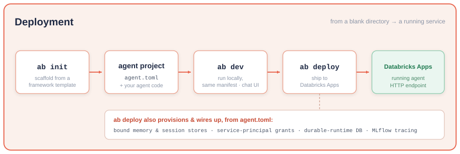
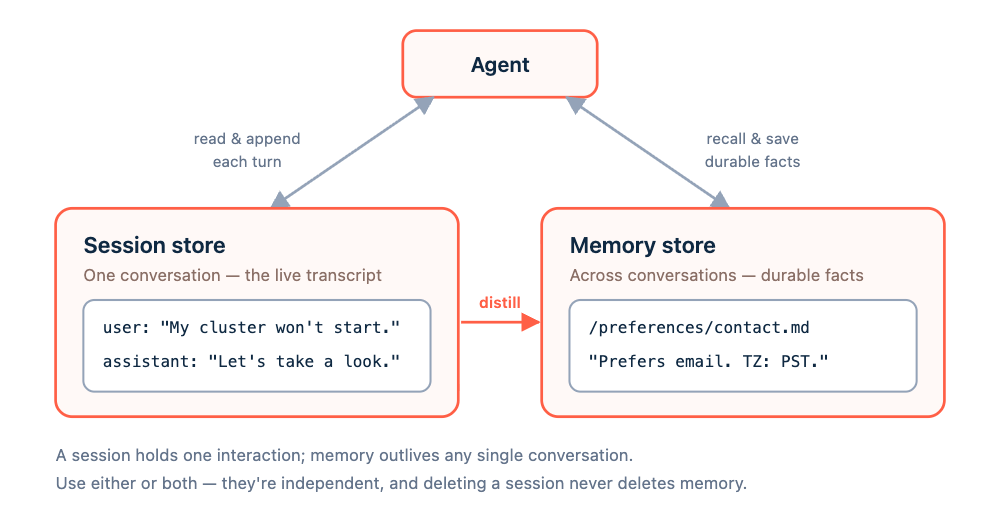

# Agent Bricks CLI (`agentbricks`)

Agent Bricks CLI is an experimental command-line interface for building and deploying custom
agents on Databricks. It manages memory, sessions, tracing, and deployments from one authenticated
command.

> The underlying APIs are in preview and may need workspace enablement.

## Prerequisites

- **Python ≥3.10** to run the CLI; generated agent projects require Python 3.11+.
- **[`uv`](https://docs.astral.sh/uv/)** to scaffold, run, and deploy an agent. Resource
  commands can run without it; reading local traces requires it.
- **[Databricks CLI](https://docs.databricks.com/dev-tools/cli/)** for browser-based
  `agentbricks login`. An already-authenticated profile does not require it.

## Installation

From PyPI:

The `databricks-agentbricks` Python distribution installs the `agentbricks` command and AgentKit.

```sh
pip install databricks-agentbricks
```

From source:

```sh
pip install 'git+https://github.com/databricks/databricks-ai-bridge.git#subdirectory=integrations/agentbricks'
```

The base package includes the CLI, store SDK, and `DurableAgentServer` HTTP runtime. Generated projects
declare their framework dependencies automatically.

## Quickstart

Create a project using LangGraph (the default framework). Use `--framework openai` instead to
create an **OpenAI Agents SDK** project. This chooses the agent framework, not the model provider;
both templates call a Databricks AI Gateway model. Their state and recovery behavior is summarized
under [Resource and state lifecycle](#resource-and-state-lifecycle).

```sh
agentbricks init my-agent --framework langgraph --profile <profile>
cd my-agent
agentbricks login --profile <profile>
agentbricks dev
```

`init` copies a project with a chat UI by default and records the chosen profile in its local `.env`.
`agentbricks dev` serves it at the URL it prints (by default `http://localhost:8000`). Open the UI
and send a message to verify the agent. Stop `dev` with Ctrl-C before deploying:

```sh
agentbricks deploy my-agent
agentbricks deployments get agent-bricks-my-agent
```

`agentbricks deploy my-agent` deploys a Databricks App named `agent-bricks-my-agent`, provisions the
stores declared in `agent.toml`, and attempts to grant the App access to them. Check the deploy
output for access or tracing warnings. `deployments get` prints the App URL and status; open the URL
and send a message to verify the deployed agent.

## Add a custom tool

In the generated project, add `agent/tools/count_words.py`. Choose the version that matches the
framework selected during `init`:

LangGraph:

```python
from langchain_core.tools import tool


@tool
def count_words(text: str) -> int:
    """Count whitespace-separated words in text."""
    return len(text.split())
```

OpenAI Agents SDK:

```python
from agents import function_tool


@function_tool
def count_words(text: str) -> int:
    """Count whitespace-separated words in text."""
    return len(text.split())
```

Both templates discover decorated tools in `agent/tools/` automatically; no registration edit is
needed. Restart `agentbricks dev`, then run this in another terminal from the project directory:

```sh
SESSION_ID=$(python3 -c 'import uuid; print(uuid.uuid4())')
INVOCATION_ID=$(python3 -c 'import uuid; print(uuid.uuid4())')
agentbricks endpoint invoke --url http://localhost:8000 \
  --path /api/invocations \
  --json "{\"id\":\"$INVOCATION_ID\",\"session_id\":\"$SESSION_ID\",\"input\":{\"messages\":[{\"role\":\"user\",\"content\":\"Use count_words to count the words in: the quick brown fox\"}]}}"
```

The `count_words` tool returns `4` for that phrase. Keep `SESSION_ID` for later turns in the same
conversation, and use a new invocation ID for each new request.
Edit `agent/agent.py` to change the model, instructions, or agent logic. For Databricks-managed
bindings, see [Agent tools](#agent-tools); for state, see [Memory and sessions](#memory-and-sessions)
and [Resource and state lifecycle](#resource-and-state-lifecycle). See [Runtime](#runtime) for the
HTTP contract and recovery, and [Project ownership and upgrades](#project-ownership-and-upgrades)
when maintaining a customized scaffold.

## Authentication

Agent Bricks CLI uses [Databricks authentication](https://docs.databricks.com/aws/en/dev-tools/cli/authentication).
Ask the CLI to authenticate and remember a named profile:

```sh
agentbricks login --profile <profile>
agentbricks sessions stores list
```

`agentbricks login` validates existing credentials first. If credentials are missing or rejected in
an interactive terminal, the CLI runs `databricks auth login --profile <profile>`, revalidates the
profile, and stores the selection in the existing `~/.agentbricks/config.json` state file. This
browser-based setup requires the Databricks CLI. In non-interactive environments, authenticate the
profile before running `agentbricks`. `agentbricks logout` forgets the saved selection without revoking the underlying
credentials.

If Databricks SDK default authentication is already configured, you can skip `agentbricks login`.
You can also pass the global `--profile/-p` option before an individual command, for example
`agentbricks --profile <profile> tools list`. Use `--output json` for scripting.

## Where to go next

| Task | Guide |
| --- | --- |
| Understand local and deployed state | [Resource and state lifecycle](#resource-and-state-lifecycle) |
| Maintain a customized project | [Project ownership and upgrades](#project-ownership-and-upgrades) |
| Control deployment packages | [Deployment dependency inputs](#deployment-dependency-inputs) |
| Add Databricks-managed tools | [Agent tools](#agent-tools) |
| Bring an existing agent | [Migration](#bring-an-existing-agent) |
| Look up commands and options | [CLI command reference](cli.md) |

## How it works

`agentbricks init` copies a LangGraph or OpenAI Agents project that you can edit. `agentbricks dev`
runs it locally; `agentbricks deploy` packages the project as a Databricks App and provisions
its declared stores. The generated project uses `DurableAgentServer` for synchronous, streaming,
and background invocations. With `--server custom`, you provide your own HTTP server and protocol.



See [Runtime](#runtime) for the server contract.

## Project ownership and upgrades

`agentbricks init` copies the template bundled with the installed CLI into your project. You own the
copied `agent/`, `runtime/`, `app.yaml`, and `pyproject.toml` files; edit them to customize the agent.
The installed `databricks-agentbricks` dependency supplies `databricks_agentkit`, including
`DurableAgentServer` and the framework adapters imported by those files. Updating that dependency
updates the library code. New template files are copied only into new projects, so review and merge
later template changes into a customized project yourself.

`agentbricks --version` shows the installed CLI version, and `init` prints the bundled template's
package version as `Template ref`. Save that output if you need the template's exact origin:
`.agentbricks/project.toml` records the framework and template name, but not the package version.
The project's `pyproject.toml` declares a version range for the runtime dependency. After the first
`dev` run, check the version actually installed in the project environment with:

```sh
.venv/bin/python -c "from importlib.metadata import version; print(version('databricks-agentbricks'))"
```

To adopt a new release while preserving your changes:

1. Commit or back up the customized project. Choose the target version and update its
   `databricks-agentbricks[langgraph]` or `databricks-agentbricks[openai]` requirement in
   `pyproject.toml`. Pin an exact version when you need the same direct dependency on every build.
2. Run `uv lock`, `agentbricks dev --prepare-environment`, and `uv run pytest` from the project.
   The explicit environment rebuild is needed because later `dev` runs reuse `.venv`.
3. Upgrade the CLI, scaffold a **different directory** with the same `--framework`, `--server`,
   and `--disable-chat-app` choices as your project, and compare its `agent/`, `runtime/`,
   `app.yaml`, and `pyproject.toml` with your project. Merge the template changes you want and run
   the project tests again. `init` refuses to overwrite an existing directory; it does not upgrade
   copied files in place.
4. Redeploy the existing app name and inspect `agentbricks deployments logs <app-name>` for the
   resolved packages and startup errors. Check the agent through its URL or an
   [endpoint invocation](#invoke-http-endpoints).

## Deployment dependency inputs

The generated `pyproject.toml` declares Python packages; `app.yaml` runs `uv run start-server` in
Databricks Apps. Released packages can come from the configured package index (public PyPI by
default, or `agentbricks deploy --pip-index-url <index-url>`). For an unreleased package, use a
`[tool.uv.sources]` Git source pinned to a pushed commit that the Apps build can reach. A local path
or `file://` source is unavailable inside the Apps build; see the
[development source examples](CONTRIBUTING.md#testing-sdk--runtime-changes-in-a-scaffold).

`agentbricks deploy` uploads the project source but excludes the local `uv.lock`; the Apps build
resolves dependencies against its own index. The generated `>=` requirements can therefore resolve
to newer packages on a later deployment. Pin direct dependency versions in `pyproject.toml`, verify
the selected package index and reachable Git commits, then compare the local environment with the
deployed build logs. The current deploy flow does not provide a frozen transitive dependency graph
from the local lockfile. Keep `agent.toml` bindings and the chosen app name alongside the dependency
manifest so the same deployment targets the same managed resources.

## Resource and state lifecycle

The default managed-server template declares memory, session, and tracing names in `agent.toml`.
`init` writes those declarations without creating workspace resources. `deploy` resolves them in the
target workspace, creates missing resources, reuses accessible ones with matching names, creates or
updates the App, rolls out the source, then attempts the App's store and trace access grants. An existing
name that the caller cannot access causes an error. A grant failure can leave a deployed App without the
corresponding feature; inspect deploy warnings.
`agentbricks memory/sessions bind` and `unbind` edit `agent.toml`; they do not delete remote stores.
After a memory or session unbind, redeploy currently leaves any earlier `AGENT_MEMORY_STORE` or
`AGENT_SESSION_STORE` setting in `app.yaml` in place. Remove the stale setting from `app.yaml` before
redeploying if you want the App to stop using that store. A clean tracing unbind is removed on the
next deploy.
Default store names contain a six-letter token (`<name>-<token>-memory` and
`<name>-<token>-sessions`); use `agentbricks memory bind <name>` or
`agentbricks sessions bind <name>` to select existing stores. The default tracing experiment is
under `/Shared/agentbricks_traces/`; `agentbricks tracing list` shows available traces.

| Resource or state | Created or reused | Local `dev` and restart | Redeploy and cleanup |
| --- | --- | --- | --- |
| Project files and dependencies | `init` copies a template; `dev` builds `.venv` from `pyproject.toml`. | Source files stay on disk. The local environment is reused until `dev --prepare-environment` rebuilds it. | Deploy syncs source and resolves dependencies again without the local `uv.lock`. App deletion leaves the local project alone. |
| Databricks App | Deploy creates the named App or reuses it, then updates compute and source. | `dev` serves the project locally without creating an App. | Redeploy with the same name updates that App; `agentbricks deployments delete <app-name>` deletes it. |
| Invocation Runtime Store | The current default deploy creates or reuses an App-owned database in the workspace's shared Lakebase project. An internal legacy path uses a per-App Lakebase project. | `dev` keeps invocation status, results, and events in process; they disappear on restart. | Deployed invocation records persist across restart and redeploy. Queued work can resume; active work needs a recovery handler and may run more than once. `agentbricks deployments delete` removes the managed store before the App; the legacy delete path does not explicitly remove its Lakebase project. |
| Managed tool access | Deploy reconciles direct App-auth tool grants from `agent.toml` before source upload, then finalizes Agent Bricks-owned App resources after rollout; request-user tools use the caller's permissions. | `dev` creates no App service principal or Apps grants. | Removing a tool binding removes Agent Bricks-owned Apps resources on redeploy. MCP and Workspace grants are additive; see [automatic App-identity access](docs/agent-tools.md#automatic-app-identity-access-on-deploy). |
| Memory Store | Deploy creates a declared store if missing or reuses an accessible store by name, then attempts the App grant. | Managed long-term memory is off in `dev`. | Memory persists independently of the App; redeploy reuses the bound store. Unbinding or deleting the App does not delete it. Remove the stale `app.yaml` setting to detach it after unbind; use the separate store delete command when appropriate. |
| Session Store | Deploy creates or reuses a declared store by name, then attempts the App grant. | `dev` keeps conversation state in process, so a restart loses it. | A bound store preserves LangGraph checkpoints and OpenAI Agents SDK transcripts across restart and redeploy. OpenAI pending approval `RunState` stays in process. Unbinding or deleting the App does not delete the store; remove the stale `app.yaml` setting to detach it. |
| MLflow traces | `dev` uses a local MLflow server; deploy attempts to create or reuse the bound workspace experiment and grant App access. | Local traces are recorded in `.agentbricks/`; they remain on disk after `dev` stops. | Deployed traces remain in the workspace experiment. Unbinding removes the App's tracing configuration on a later clean deploy; it does not delete the experiment. |

Redeploying an older App can attach the current managed Runtime Store without migrating invocation
records from its legacy per-App Lakebase project. Managed-store cleanup errors retain the App for
retry; deleting the App directly bypasses that cleanup.

The Runtime Store tracks HTTP invocations, status, results, and event replay. The framework's
conversation history belongs to its Session Store when bound. The generated chat UI keeps its
session ID in browser local storage and sends that ID as the top-level `session_id` with each turn.
`DurableAgentServer` accepts an optional top-level `session_id` for generic handlers, but the generated
LangGraph and OpenAI Agents templates require a nonempty top-level `session_id` on every invocation.
API clients should reuse that value for conversation continuity and send a new invocation `id` for each
turn.
By default, the templates use the session ID as the state actor; request-user-authenticated
invocations namespace session state by user. LangGraph can resume from a matching checkpoint after
worker loss; the OpenAI Agents SDK template replays the input against its saved transcript.
Recovery can repeat external side effects, so make tools idempotent. For request-user-authenticated
tools, credentials are not persisted and background recovery is unsupported.

The default chat UI keeps its session ID across page reloads;
[invoke HTTP endpoints](#invoke-http-endpoints) shows the explicit API request shape.

## Runtime

`DurableAgentServer` exposes `POST /api/invocations` for synchronous, streaming, and background
runs, plus status and event endpoints for polling and reconnecting. A client-generated UUID `id`
identifies each invocation. Generated LangGraph and OpenAI Agents projects also require a nonempty
*top-level* `session_id` on every request; reuse it across turns in one conversation.

During `dev`, invocation state is in process. Deployment provisions a persistent Runtime Store, so
status, results, and events survive restarts. App-authenticated work can resume through an `@app.recover`
handler; recovery may repeat external side effects. Request-user credentials remain process-local,
so interrupted user-authenticated work cannot resume after worker loss. A custom server defines its
own HTTP and recovery behavior and receives no Runtime Store.

See the [runtime guide](src/databricks_agentkit/runtime/README.md) for hooks, endpoint responses,
streaming, recovery, and custom-server setup. The [lifecycle matrix](#resource-and-state-lifecycle)
explains what persists across local restarts, redeployments, and deletion.

## AgentKit SDK

Use `AgentKitClient` from `databricks_agentkit` with an authenticated Databricks
`WorkspaceClient`, or omit the client to use default Databricks SDK authentication. Its
`memory_stores` and `session_stores` collections create, get, and list stores. A returned store
manages its entries or sessions; returned memories and sessions own their `update()` and
`delete()` operations. The [examples below](#memory-and-sessions) show the store APIs.

All `list()` methods return iterators that consume server pages automatically. List `page_size`
and search `limit` values must be between 1 and 100. `session.list_items()` also auto-pages.

## Memory and sessions

To hold context, an agent needs two kinds of state: the state of the interaction it is handling right
now, and the durable knowledge it carries from one conversation to the next. Databricks provides a
fully managed store for each, both backed by Lakebase and usable from agents built on any framework:

- **Managed agent sessions** store an agent's session state: the state an agent or framework keeps
  for one interaction. Most commonly this is the conversation history (the ordered transcript of
  messages, tool calls, and results), but it can be any state a framework persists, such as a
  LangGraph graph. The agent reads it at the start of a turn and appends to it as the interaction
  runs.
- **Managed agent memory** stores durable facts, preferences, and decisions that an agent recalls in
  later, separate conversations through text search.

The examples below use the [`AgentKitClient` Python SDK](#agentkit-sdk); the same operations are available
as `agentbricks sessions` / `agentbricks memory` CLI commands.



### Sessions

A **session store** holds **sessions**, and each session holds an ordered list of **session items**. A
session is one interaction — typically a conversation thread — grouped under an `actor_id` (who it
belongs to; set this from trusted application context, never a model- or user-supplied value) and
identified by a caller-chosen `session_id` (the service generates one if you omit it). Each item is an
opaque, JSON-compatible `data` value — a message, tool call, result, or reasoning block — that
Databricks stores and returns verbatim, in order, and never mutates once appended.

Create a store, start a session, append the conversation's turns, and read the history back on a later
request:

```python
from databricks.sdk import WorkspaceClient
from databricks_agentkit import AgentKitClient

agentkit = AgentKitClient(WorkspaceClient())

session_store = agentkit.session_stores.create("support-agent-sessions")
session = session_store.add(actor_id="customer-123", session_id="case-456")

session.append_items(
    [
        {"type": "message", "role": "user", "content": "I need help with my cluster."},
        {"type": "message", "role": "assistant", "content": "Let's take a look."},
    ]
)

# On a later turn, reload the session and read its full history in order.
session = session_store.get("case-456")
history = [item.data for item in session.list_items()]  # list_items auto-pages
```

A session can be **forked** into an independent branch: a new session seeded with the original's
history, linked back to its origin by `parent_session_id`. Fork the full history, or only up to a
specific item, to explore an alternate continuation without disturbing the original thread:

```python
branch = session.fork(actor_id="customer-123")  # add up_to_item_id=... to branch up to one item
```

Deleting a session that has such descendants requires `session.delete(force=True)` to cascade.

In an agent configured with `server = "agentbricks"`, you don't call these directly — the framework adapter reads and appends
session state for you. With LangGraph, pass `checkpointer()` when you build the agent and scope each
run with `thread_config(session_id)`; the OpenAI Agents adapter exposes the same as
`session_store(session_id)`:

```python
from databricks_agentkit.langgraph import checkpointer, thread_config

agent = create_agent(model=..., tools=[...], checkpointer=checkpointer())
result = await agent.ainvoke(inputs, config=thread_config(session_id))
```

### Memory

A **memory store** holds **memory entries**. Each entry is a free-form `content` string plus a short
`description` used for retrieval, keyed by three fields: `actor_id` (whose memory it is — set from
trusted application context, never a model- or user-supplied value), `path` (a filesystem-like key
within an actor, such as `/preferences/response-style.md`), and an optional `session_id` (the session
an entry came from, for provenance). An entry is uniquely identified by its `actor_id`, `path`, and
optional `session_id`.

Write an entry when the agent learns something durable, then recall it in a later, separate
conversation with a natural-language search — results are ranked by full-text (BM25) relevance, up to
100 entries, with no pagination or vector similarity:

```python
from databricks.sdk import WorkspaceClient
from databricks_agentkit import AgentKitClient

agentkit = AgentKitClient(WorkspaceClient())

memory_store = agentkit.memory_stores.create("support-agent-memory")
memory_store.add(
    actor_id="user-123",
    path="/preferences/communication.md",
    content="Prefers email over phone. Timezone: PST.",
    description="User 123 communication preferences",
)

# In a later, separate conversation, recall what the agent knows about this user.
results = memory_store.search(actor_id="user-123", query="communication preferences", limit=10)
```

To browse rather than search, `memory_store.list(actor_id=..., path_prefix=...)` returns entries
directly.

In an agent configured with `server = "agentbricks"`, add the memory tools so the model can read and write memory during a run.
`memory_tools(actor)` exposes `remember` and `recall` bound to one actor's partition; it resolves the
store from the `[memory_store]` binding, carried to the runtime by the `AGENT_MEMORY_STORE` env var
that `agentbricks deploy` injects, and returns no tools when no store is set, so the agent runs unchanged.
That "no store set" path is also how it runs under `agentbricks dev`, which runs locally: memory is off
there (the store is provisioned and used only at deploy). The OpenAI Agents adapter exposes the same as
`memory_tools()`:

```python
from databricks_agentkit.langgraph import memory_tools

agent = create_agent(model=..., tools=[*your_tools, *memory_tools(actor)])
```

> **`actor_id` partitions data; it is not access control.** Both stores are workspace-scoped and
> authorized at the store level, so any principal that can reach a store can read and write every
> actor's entries. For strict isolation between tenants or users, use a separate store per boundary.
> Grant another principal — such as your app's service principal — access with
> `session_store.grant_permission(principal_id)` or `memory_store.grant_permission(principal_id)`;
> `agentbricks deploy` attempts this grant for the deployed app.

### Declaring and provisioning stores

`init` declares default store names in `agent.toml`. Use `--memory-store` and
`--session-store` during `init`, or `agentbricks memory bind <name>` and
`agentbricks sessions bind <name>` later, to select other stores. Binding edits the
manifest; `deploy` creates missing stores and attempts the App grants. Memory and
session stores are independent resources: deleting one does not affect the other.

## Agent tools

For generated managed-server projects, declare Databricks-managed sandbox, MCP, Unity Catalog
function, or Genie bindings in `agent.toml`. `agentbricks tools add` edits that manifest;
`deploy` provisions access according to each binding's App or request-user identity. Python
tools use the framework's native decorator in `agent/tools/`, as in the
[custom-tool quickstart](#add-a-custom-tool).

```sh
agentbricks tools add sandbox --scope table:samples.nyctaxi.trips
agentbricks tools add mcp system.ai.web_search
agentbricks tools add uc-function catalog.schema.lookup_ticket
agentbricks tools list
```

`tools list` shows integrations available to add; inspect `agent.toml` for configured bindings.
The [Agent tools guide](docs/agent-tools.md) covers identities, grants, scopes, sandbox policies,
Genie behavior, and migration of older bindings. For command options, see
[the CLI reference](cli.md#agentbricks-tools).

## Bring an existing agent

From an existing LangGraph or OpenAI Agents project, run `agentbricks doctor .` to inspect its
configuration, then `agentbricks init --framework <framework> --existing .` to create migration
instructions and a reference project. A coding agent performs the conversion; `init` leaves
application source, dependencies, and local credentials intact. See
[the migration guide](docs/migrating-existing-agents.md) for the generated bundle, limits, and
state-transition decisions.

## Invoke HTTP endpoints

`agentbricks endpoint invoke` sends a complete request to a deployed App or a local URL. Generated
agents require a new invocation UUID for each turn and a stable top-level `session_id` for the
conversation:

```sh
SESSION_ID=$(python3 -c 'import uuid; print(uuid.uuid4())')
INVOCATION_ID=$(python3 -c 'import uuid; print(uuid.uuid4())')
agentbricks --profile <profile> endpoint invoke agent-bricks-my-agent \
  --path /api/invocations \
  --json "{\"id\":\"$INVOCATION_ID\",\"session_id\":\"$SESSION_ID\",\"input\":{\"messages\":[{\"role\":\"user\",\"content\":\"Hello\"}]}}"
```

For another turn, reuse `SESSION_ID` and generate a new invocation ID. `--routing-key "$SESSION_ID"`
adds the independent `X-Routing-Key` sticky-routing header; it does not set `session_id` in the
request body. Use `--sse` with a body containing `"stream": true`. See the
[runtime guide](src/databricks_agentkit/runtime/README.md#invoke-stream-and-reconnect) for the
HTTP contract and [CLI reference](cli.md#agentbricks-endpoint-invoke) for command options.

## Commands

See [the CLI command reference](cli.md) for all commands, arguments, and options. Built-in
examples are available at each level, such as `agentbricks deploy --help`.

For zsh completion, add this to `~/.zshrc`:

```sh
eval "$(_AGENTBRICKS_COMPLETE=zsh_source agentbricks)"
```

## Chat app

Both generated framework projects include a browser chat UI by default; use
`--disable-chat-app` for an API-only project. The [LangGraph](src/databricks_agentbricks/templates/ui/agent-langgraph/CHAT_APP.md)
and [OpenAI Agents SDK](src/databricks_agentbricks/templates/ui/agent-openai/CHAT_APP.md)
overlay guides describe the UI, session IDs, routing, and demo endpoints.

## Contributing

Developing Agent Bricks CLI (`agentbricks`), AgentKit, the runtime, and templates - plus the local dev loop and how to
test unreleased changes on `agentbricks dev` and `agentbricks deploy`, is covered in
[CONTRIBUTING.md](CONTRIBUTING.md).
