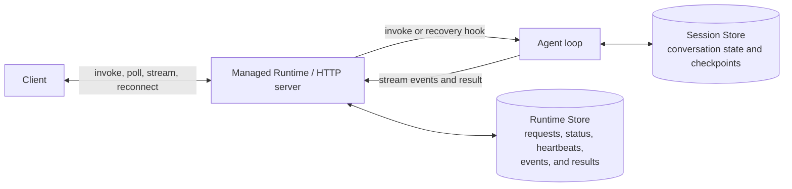

# Managed agent deployment and runtime

Agent Bricks CLI takes your agent code from a local project to a hosted endpoint on Databricks. Start with a
LangGraph or OpenAI Agents template, or bring an existing agent.

- **Deployment:** Scaffold a project, run it locally, and deploy it to Databricks Apps. The CLI
  provisions the stores declared in your project, grants the app access, and configures tracing.
- **Runtime:** `DurableAgentServer` provides synchronous, streaming, and background execution, with persistent
  results and automatic crash recovery on deployment. Request-user authentication is attached only
  to the active first attempt and is never persisted.

## Choose your server

**Managed server (`server = "agentbricks"`).** Register your agent with `DurableAgentServer` to use the managed
invocation API. This existing `server` value identifies the managed server in `agent.toml`. Deployed
managed servers receive a Lakebase-backed Runtime Store. Register a recovery handler so the runtime
can restart interrupted app-auth work and mark interrupted request-user work failed.
`DurableAgentServer` is a FastAPI application: you can add custom endpoints alongside the invocation API.

If any configured tool uses `auth = "user"`, trusted Databricks Apps ingress headers supply a
process-local credential for the first execution attempt. Synchronous, streaming, and background
requests continue through the normal Runtime queue and Runtime Store. The store contains token-free
request state, events, and results; it never contains the forwarded credential. A replacement
attempt after failure recovery stops before agent code runs because the original credential is no
longer available.

**Your own server (`server = "custom"`).** Keep your existing HTTP server, or scaffold a minimal
FastAPI server with `agentbricks init --server custom`. You own the endpoints, request and response
formats, and execution behavior. `agentbricks dev` and `agentbricks deploy` still run and deploy the project;
the managed runtime does not provision a Runtime Store for it.

## From a new agent to a deployed endpoint

```bash
agentbricks init my-agent --framework langgraph --server agentbricks --profile <profile>
cd my-agent
agentbricks dev
# Stop the local server when ready to deploy.
agentbricks --profile <profile> deploy my-agent
```

Use `--framework openai` for OpenAI Agents. Managed-server templates include a chat UI and tests;
pass `--disable-chat-app` for an API-only project.

1. **Initialize:** `agentbricks init` generates the agent code and runtime adapter separately. It records
   the server choice and default `my-agent-memory` / `my-agent-session` bindings in `agent.toml`.
2. **Develop:** Edit your model, prompts, and tools in `agent/`. `agentbricks dev` runs the project locally.
   Synchronous, streaming, and background requests use the same Runtime for both authorization
   policies.
3. **Deploy:** `agentbricks deploy` creates or reuses the declared Session and Memory Stores, grants the
   app's service principal access, configures tracing, and deploys the app. For a managed server,
   it also creates or reuses the deployment's Runtime Store.

The generated configuration starts with:

```toml
schema_version = 1

[agent]
framework = "langgraph"
server = "agentbricks"

[memory_store]
name = "my-agent-memory"

[session_store]
name = "my-agent-session"

[tracing]
experiment_name = "/Shared/agentbricks_traces/my-agent"
```

Override store names at initialization with `--memory-store` and `--session-store`, or later with
`agentbricks memory bind <name>` and `agentbricks sessions bind <name>`. Custom-server templates declare these
stores only when explicitly requested. Tracing is bound by experiment **name** (its presence turns
tracing on); rebind or clear it with `agentbricks tracing bind --experiment-name <path>` / `agentbricks tracing
unbind`.

Use `agentbricks deployments list`, `get`, `logs`, `start`, `stop`, and `delete` to manage deployed apps.
See the [CLI documentation](../../../README.md#commands) for command options.

## Connect your agent to the runtime

Keep framework code in `agent/` and HTTP setup and event translation in `runtime/`. The generated
[LangGraph](../../databricks_agentbricks/templates/agent-langgraph/runtime/adapter.py) and
[OpenAI Agents](../../databricks_agentbricks/templates/agent-openai/runtime/adapter.py) adapters show how to
connect framework-native agent loops to the managed runtime.

- **`@app.invoke`:** Register an async handler that receives the request's `input` and an
  `InvocationContext`. Return a JSON-serializable result.
- **`await context.emit(event)`:** Publish a JSON event from the handler or adapter. The Runtime
  stores and delivers events through its streaming API.
- **`@app.recover`:** Register the handler the runtime calls for a replacement attempt after interrupted
  execution. It receives the original input and a recovery context. Restore a framework checkpoint
  from the Session Store, or replay the input if that is safe for your agent. Request-user recovery
  stops with `MCP_USER_AUTH_RECOVERY_UNSUPPORTED` before this handler runs.

The client chooses `background` and `stream` on each request; separate agent handlers are not
needed. Registering a recovery hook enables automatic recovery when the Runtime uses a persistent
store.

For an existing agent, retain its framework code and add the runtime adapter and `DurableAgentServer`
entrypoint. Set `[agent].server = "agentbricks"` and have `app.yaml` start that entrypoint. Keep the
existing `agentbricks` value for projects that use the managed server. Changing the configuration field
alone does not convert a custom HTTP server into `DurableAgentServer`.

Newly generated runtime code imports from `databricks_agentkit`. The AgentKit client uses
`databricks_agentkit.AgentKitClient`.

## Invoke, stream, and reconnect

An **invocation** is one managed agent run. The client-supplied UUID `id` acts as an idempotency key
while its Runtime record is retained. Request-user invocation IDs are internally namespaced by the
forwarded principal so users cannot collide with each other.

- **Synchronous:** Wait for the result in the POST response.
- **Streaming (`stream: true`):** Receive progress events as Server-Sent Events (SSE).
- **Background (`background: true`):** Return immediately with `202`, then poll for the result.
  Add `stream: true` to include an events URL in the response.
- **Reconnect:** Read stored events with `GET .../events?after=<last-event-id>`.

These examples use an agent that returns `{"answer":"Hello"}` and emits `delta` events. The input,
output, and application event payloads are defined by your agent or framework adapter.

| API endpoint | Request | Response |
| --- | --- | --- |
| `POST /api/invocations` | `{"id":"550e8400-e29b-41d4-a716-446655440000","input":{"messages":[{"role":"user","content":"Hello"}]}}` | `200`<br>`{"id":"550e8400-e29b-41d4-a716-446655440000","status":"completed","output":{"answer":"Hello"}}` |
| `POST /api/invocations` | `{"id":"550e8400-e29b-41d4-a716-446655440000","input":{"messages":[{"role":"user","content":"Hello"}]},"stream":true}` | `200 text/event-stream`<br>`id: 1`<br>`event: run.started`<br>`data: {"type":"run.started"}`<br><br>`id: 2`<br>`event: delta`<br>`data: {"type":"delta","content":"Hello"}`<br><br>`id: 3`<br>`event: run.completed`<br>`data: {"type":"run.completed"}` |
| `POST /api/invocations` | `{"id":"550e8400-e29b-41d4-a716-446655440000","input":{"messages":[{"role":"user","content":"Hello"}]},"background":true}` | `202`<br>`{"id":"550e8400-e29b-41d4-a716-446655440000","status":"queued","status_url":"/api/invocations/550e8400-e29b-41d4-a716-446655440000"}` |
| `POST /api/invocations` | `{"id":"550e8400-e29b-41d4-a716-446655440000","input":{"messages":[{"role":"user","content":"Hello"}]},"background":true,"stream":true}` | `202`<br>`{"id":"550e8400-e29b-41d4-a716-446655440000","status":"queued","status_url":"/api/invocations/550e8400-e29b-41d4-a716-446655440000","events_url":"/api/invocations/550e8400-e29b-41d4-a716-446655440000/events"}` |
| `GET /api/invocations/550e8400-e29b-41d4-a716-446655440000` | — | `200`<br>`{"id":"550e8400-e29b-41d4-a716-446655440000","status":"completed","output":{"answer":"Hello"}}` |
| `GET /api/invocations/550e8400-e29b-41d4-a716-446655440000/events?after=1` | — | `200 text/event-stream`<br>`id: 2`<br>`event: delta`<br>`data: {"type":"delta","content":"Hello"}`<br><br>`id: 3`<br>`event: run.completed`<br>`data: {"type":"run.completed"}` |

## Execution state and agent state

The state diagram below applies to both authorization policies. Request-user authentication is a
process-local input to the active first attempt; it is not part of the Runtime Store, Session Store,
or Memory Store.



- **Runtime Store:** Requests, status, heartbeats, events, and results used by the runtime to manage
  invocations, serve polling and reconnection, and detect interrupted work.
- **Session Store:** Conversation history and framework checkpoints used by the agent. A recovery
  handler can use these checkpoints to resume the agent loop.
- **Memory Store:** Long-term facts and preferences reused across conversations.

### Local development

`agentbricks dev` supports the same invocation APIs with an **In-process Runtime Store**. Run state,
events, and results are lost when the serving process exits. Interrupted work is not automatically
restarted. Session and Memory Store persistence is separate from this local execution state.

### Deployed execution

`agentbricks deploy` provisions a dedicated PostgreSQL database for each deployment with `server = "agentbricks"` and
reuses it on redeployment. Results and events survive worker restarts, and any replica can serve
polling and stream-reconnection requests. With a recovery handler registered, the runtime detects stale
heartbeats and starts a replacement attempt on an available worker.

App-auth replacement attempts call the registered recovery handler. Request-user replacement
attempts fail with `MCP_USER_AUTH_RECOVERY_UNSUPPORTED` before agent code runs because the original
forwarded credential was intentionally not persisted.

Recovery is **at-least-once**: an interrupted attempt may already have performed external side
effects before its replacement starts. Make those operations idempotent. Request deduplication
does not guarantee that agent code or external side effects execute only once.

The managed deployment provisions the Runtime Store's database, schema, and access, so you do not
create or bind it separately. Session and Memory Stores are independently named resources that
can be shared intentionally between agents.

Changing the server type of an existing deployment is not supported. Scaffold a new project with
the desired `agentbricks init --server` option and deploy it under a new name. `agent.toml` remains editable,
but changing its `server` field does not convert application code or clean up deployment resources.

For runtime contributors, see the [architecture and code map](ARCHITECTURE.md).
