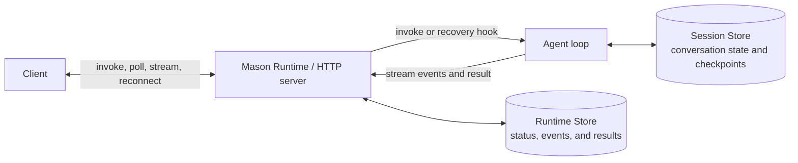

# Mason Runtime

Mason Runtime is the HTTP execution layer between a client and an agent loop.

Mason calls each managed agent run an **invocation**. One request to start work creates one
invocation with a stable ID that the client can poll, stream, or reconnect to. The invocation ID
also acts as an idempotency key: retrying the same request with the same ID reuses the existing
invocation instead of starting duplicate work, while reusing the ID with different input is
rejected.

## What Mason Runtime provides

- **Invocations API** for foreground, background, and streaming execution:

  | Endpoint | Body | Response |
  | --- | --- | --- |
  | `POST /api/invocations` | `{"id":"550e8400-e29b-41d4-a716-446655440000","input":{"messages":[{"role":"user","content":"Hello"}]}}` | `200`<br>`{"id":"550e8400-e29b-41d4-a716-446655440000","status":"completed","output":{"answer":"Hello"}}` |
  | `POST /api/invocations` | `{"id":"550e8400-e29b-41d4-a716-446655440000","input":{"messages":[{"role":"user","content":"Hello"}]},"stream":true}` | `200 text/event-stream`<br>`id: 1`<br>`event: run.started`<br>`data: {"type":"run.started"}`<br><br>`id: 2`<br>`event: delta`<br>`data: {"type":"delta","content":"Hello"}`<br><br>`id: 3`<br>`event: run.completed`<br>`data: {"type":"run.completed"}` |
  | `POST /api/invocations` | `{"id":"550e8400-e29b-41d4-a716-446655440000","input":{"messages":[{"role":"user","content":"Hello"}]},"background":true}` | `202`<br>`{"id":"550e8400-e29b-41d4-a716-446655440000","status":"queued","status_url":"/api/invocations/550e8400-e29b-41d4-a716-446655440000"}` |
  | `POST /api/invocations` | `{"id":"550e8400-e29b-41d4-a716-446655440000","input":{"messages":[{"role":"user","content":"Hello"}]},"background":true,"stream":true}` | `202`<br>`{"id":"550e8400-e29b-41d4-a716-446655440000","status":"queued","status_url":"/api/invocations/550e8400-e29b-41d4-a716-446655440000","events_url":"/api/invocations/550e8400-e29b-41d4-a716-446655440000/events"}` |
  | `GET /api/invocations/550e8400-e29b-41d4-a716-446655440000` | — | `200`<br>`{"id":"550e8400-e29b-41d4-a716-446655440000","status":"completed","output":{"answer":"Hello"}}` |
  | `GET /api/invocations/550e8400-e29b-41d4-a716-446655440000/events?after=1` | — | `200 text/event-stream`<br>`id: 2`<br>`event: delta`<br>`data: {"type":"delta","content":"Hello"}`<br><br>`id: 3`<br>`event: run.completed`<br>`data: {"type":"run.completed"}` |

- **Persistent results and progress** by storing the request, status, stream events, and result in
  the Runtime Store.
- **Automatic recovery** by storing heartbeats in the Runtime Store, detecting interrupted work,
  and starting a replacement attempt. The agent can resume from a Session Store checkpoint or retry
  from the original input.



## Runtime Store

The Runtime Store persists the state Mason needs to manage an agent run. It is separate from the
Session and Memory Stores, which persist state used by the agent itself.

### Local development (`mason dev`)

- Supports the same foreground, background, streaming, polling, and event APIs.
- Keeps run state and results only in the serving process.
- A restart loses run state and results.
- Does not automatically restart interrupted work.

### Deployed Mason Runtime (`mason deploy`)

- Stores run state and results in a dedicated PostgreSQL database for the deployment.
- Lets any replica serve polling, result, and stream-reconnection requests.
- Preserves state and results across worker restarts.
- Detects stale heartbeats and starts a replacement attempt on an available worker.
- Provides at-least-once recovery, so external side effects should be idempotent.

## Runtime state vs. agent state

- **Runtime Store:** Mason-owned execution state for one run: input, status, heartbeats, events, and
  result. It enables polling, reconnecting, and automatic recovery.
- **Session Store:** Agent-owned conversation state and framework checkpoints. A recovery hook can
  use it to continue the agent loop from a known checkpoint.
- **Memory Store:** Optional long-term facts and preferences reused across sessions. It does not
  track run status, results, or recovery.

## Critical user journey

```bash
mason init my-agent
cd my-agent
mason memory bind agent-memory
mason sessions bind agent-sessions
mason dev
mason deploy my-agent
```

- `mason deploy my-agent` creates a dedicated Runtime Store database for the Mason server and grants
  the app access to it. Redeployments reuse that database.

The runtime- and store-related fields in `agent.toml` then look like:

```toml
schema_version = 1

[agent]
framework = "langgraph"
deployment_name = "my-agent"

[memory_store]
name = "agent-memory"
id = "<resolved-store-id>"

[session_store]
name = "agent-sessions"
```

Binding stores explicitly makes the project configuration clear. If a store is not bound,
`mason deploy` can create and bind default `<name>-memory` and `<name>-session` stores.

## Terminology

- **Product name:** Use **Mason Runtime** for the offering.
- **API:** Use **invocation** for the stable API resource; explain it as one managed agent run.
- **Lakebase store name:** Use **Runtime Store** for the component that persists invocation status,
  events, results, and recovery state. Mason creates it for each deployed Mason server; it has no
  user-defined binding.
- Avoid **Durability Store** and **durable runtime**. Session and Memory Stores are also persistent;
  the useful distinction is that the Runtime Store owns runtime execution state.

## Runtime Store lifecycle

- `mason deploy` creates and initializes one isolated database for a new Mason Runtime deployment,
  grants the app access, and reuses the same database on later deployments.
- The Runtime Store is not named, bound, or shared by developers. Mason manages its database,
  schema, permissions, and lifecycle together so one deployment cannot expose or recover another
  deployment's work.
- Session and Memory Stores are different: they are named, independently managed resources that
  developers may intentionally share between agents.
