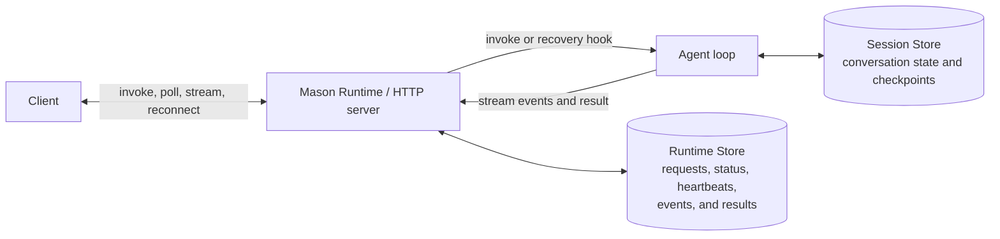

# Managed agent deployment and runtime

Mason takes your agent code from a local project to a hosted endpoint on Databricks. Start with a
LangGraph or OpenAI Agents template, or bring an existing agent.

- **Deployment:** Scaffold a project, run it locally, and deploy it to Databricks Apps. Mason
  provisions the stores declared in your project, grants the app access, and configures tracing.
- **Runtime:** App-auth projects use `AgentApp` for synchronous, streaming, and background execution,
  with persistent results and automatic crash recovery on deployment. Projects with a user-auth
  tool use foreground synchronous or streaming execution that retains no invocation state.

## Choose your server

**Mason server (`server = "mason"`).** Register your agent with `AgentApp` to use Mason's invocation
API. Deployed App-auth Mason servers receive a Lakebase-backed Runtime Store. Register a recovery
handler so Mason can restart interrupted App-auth work. `AgentApp` is a FastAPI application: you can
add custom endpoints alongside the invocation API.

If any configured tool uses `auth = "user"`, the trusted Databricks Apps ingress headers own the
credential lifetime. Synchronous requests await the handler and discard emitted events. Streaming
requests deliver those events as SSE while the response owns execution and credentials through
completion or disconnect. Neither mode submits work to the Runtime queue/store or retains status,
events, results, or invocation-ID replay state. Background execution, durable recovery, event
replay, and approval/resume are unsupported.

**Your own server (`server = "custom"`).** Keep your existing HTTP server, or scaffold a minimal
FastAPI server with `mason init --server custom`. You own the endpoints, request and response
formats, and execution behavior. `mason dev` and `mason deploy` still run and deploy the project;
Mason does not provision a Runtime Store for it.

## From a new agent to a deployed endpoint

```bash
mason init my-agent --framework langgraph --server mason --profile <profile>
cd my-agent
mason dev
# Stop the local server when ready to deploy.
mason --profile <profile> deploy my-agent
```

Use `--framework openai` for OpenAI Agents. Mason-server templates include a chat UI and tests;
pass `--disable-chat-app` for an API-only project.

1. **Initialize:** `mason init` generates the agent code and runtime adapter separately. It records
   the server choice and default `my-agent-memory` / `my-agent-session` bindings in `agent.toml`.
2. **Develop:** Edit your model, prompts, and tools in `agent/`. `mason dev` runs the project locally.
   App-auth projects support synchronous, streaming, and background requests; request-user projects
   support synchronous and streaming foreground requests.
3. **Deploy:** `mason deploy` creates or reuses the declared Session and Memory Stores, grants the
   app's service principal access, configures tracing, and deploys the app. For a Mason server,
   it also creates or reuses the deployment's Runtime Store and attaches it to App-auth projects.

The generated configuration starts with:

```toml
schema_version = 1

[agent]
framework = "langgraph"
server = "mason"

[memory_store]
name = "my-agent-memory"

[session_store]
name = "my-agent-session"

[tracing]
experiment_name = "/Shared/mason_traces/my-agent"
```

Override store names at initialization with `--memory-store` and `--session-store`, or later with
`mason memory bind <name>` and `mason sessions bind <name>`. Custom-server templates declare these
stores only when explicitly requested. Tracing is bound by experiment **name** (its presence turns
tracing on); rebind or clear it with `mason tracing bind --experiment-name <path>` / `mason tracing
unbind`.

Use `mason deployments list`, `get`, `logs`, `start`, `stop`, and `delete` to manage deployed apps.
See the [CLI documentation](../../../README.md#commands) for command options.

## Connect your agent to the runtime

Keep framework code in `agent/` and HTTP setup and event translation in `runtime/`. The generated
[LangGraph](../templates/agent-langgraph/runtime/adapter.py) and
[OpenAI Agents](../templates/agent-openai/runtime/adapter.py) adapters show how to
connect framework-native agent loops to Mason.

- **`@app.invoke`:** Register an async handler that receives the request's `input` and an
  `InvocationContext`. Return a JSON-serializable result.
- **`await context.emit(event)`:** Publish a JSON event from the handler or adapter. The App-auth
  Runtime stores and delivers events through its streaming API. Request-user execution assigns a
  request-local sequence number, sends the event on a live SSE response when requested, and never
  retains it for replay. A synchronous request discards the event after assigning its sequence.
- **`@app.recover`:** Register the handler Mason calls for a replacement attempt after interrupted
  execution. It receives the original input and a recovery context. Restore a framework checkpoint
  from the Session Store, or replay the input if that is safe for your agent.

For App-auth projects, the client chooses `background` and `stream` on each request; separate agent
handlers are not needed. Registering a recovery hook enables automatic recovery when the Runtime
uses a persistent store. Request-user clients may choose synchronous execution or set `stream: true`,
but must omit `background` because the HTTP response owns execution and credentials.

For an existing agent, retain its framework code and add the runtime adapter and `AgentApp`
entrypoint. Set `[agent].server = "mason"` and have `app.yaml` start that entrypoint. Changing the
configuration field alone does not convert a custom HTTP server into `AgentApp`.

## Invoke, stream, and reconnect

The synchronous and foreground-streaming POST examples apply to both authorization policies. For
request-user projects, `background: true` returns `400`, and status or event lookups return `404`
because no request-user record exists. Request-user SSE cannot reconnect or replay prior events.

An App-auth **invocation** is one managed agent run. The client-supplied UUID `id` acts as an
idempotency key while its Runtime record is retained. A request-user invocation does not retain that
record, so reusing its ID executes a new request.

- **Synchronous:** Wait for the result in the POST response.
- **Streaming (`stream: true`):** Receive progress events as Server-Sent Events (SSE).
- **Background (`background: true`):** Return immediately with `202`, then poll for the result.
  Add `stream: true` to include an events URL in the response.
- **Reconnect:** Read stored events with `GET .../events?after=<last-event-id>`.

These examples use an agent that returns `{"answer":"Hello"}` and emits `delta` events. The input,
output, and application event payloads are defined by your agent or framework adapter.

| API endpoint | Request | Response |
| --- | --- | --- |
| `POST /api/invocations` | `{"id":"550e8400-e29b-41d4-a716-446655440000","input":{"messages":[{"role":"user","content":"Hello"}]}}` | `200`<br>`{"id":"550e8400-e29b-41d4-a716-446655440000","status":"completed","output":{"answer":"Hello"}}` |
| `POST /api/invocations` | `{"id":"550e8400-e29b-41d4-a716-446655440000","input":{"messages":[{"role":"user","content":"Hello"}]},"stream":true}` | `200 text/event-stream`<br>`id: 1`<br>`event: run.started`<br>`data: {"type":"run.started"}`<br><br>`id: 2`<br>`event: delta`<br>`data: {"type":"delta","content":"Hello"}`<br><br>`id: 3`<br>`event: run.completed`<br>`data: {"type":"run.completed"}` |
| `POST /api/invocations` | `{"id":"550e8400-e29b-41d4-a716-446655440000","input":{"messages":[{"role":"user","content":"Hello"}]},"background":true}` | `202`<br>`{"id":"550e8400-e29b-41d4-a716-446655440000","status":"queued","status_url":"/api/invocations/550e8400-e29b-41d4-a716-446655440000"}` |
| `POST /api/invocations` | `{"id":"550e8400-e29b-41d4-a716-446655440000","input":{"messages":[{"role":"user","content":"Hello"}]},"background":true,"stream":true}` | `202`<br>`{"id":"550e8400-e29b-41d4-a716-446655440000","status":"queued","status_url":"/api/invocations/550e8400-e29b-41d4-a716-446655440000","events_url":"/api/invocations/550e8400-e29b-41d4-a716-446655440000/events"}` |
| `GET /api/invocations/550e8400-e29b-41d4-a716-446655440000` | — | `200`<br>`{"id":"550e8400-e29b-41d4-a716-446655440000","status":"completed","output":{"answer":"Hello"}}` |
| `GET /api/invocations/550e8400-e29b-41d4-a716-446655440000/events?after=1` | — | `200 text/event-stream`<br>`id: 2`<br>`event: delta`<br>`data: {"type":"delta","content":"Hello"}`<br><br>`id: 3`<br>`event: run.completed`<br>`data: {"type":"run.completed"}` |

## Execution state and agent state

The state diagram below applies to App-auth execution. Request-user work bypasses the Runtime Store;
its request-local authentication closes when the synchronous response returns or the SSE response
completes or disconnects. Framework session and memory behavior is unchanged.



- **Runtime Store:** Requests, status, heartbeats, events, and results used by Mason to manage
  invocations, serve polling and reconnection, and detect interrupted work.
- **Session Store:** Conversation history and framework checkpoints used by the agent. A recovery
  handler can use these checkpoints to resume the agent loop.
- **Memory Store:** Long-term facts and preferences reused across conversations.

### Local development

`mason dev` supports the same invocation APIs with an **In-process Runtime Store**. Run state,
events, and results are lost when the serving process exits. Interrupted work is not automatically
restarted. Session and Memory Store persistence is separate from this local execution state.

### Deployed App-auth execution

`mason deploy` provisions a dedicated PostgreSQL database for each Mason-server deployment and
reuses it on redeployment. Results and events survive worker restarts, and any replica can serve
polling and stream-reconnection requests. With a recovery handler registered, Mason detects stale
heartbeats and starts a replacement attempt on an available worker.

Recovery is **at-least-once**: an interrupted attempt may already have performed external side
effects before its replacement starts. Make those operations idempotent. Request deduplication
does not guarantee that agent code or external side effects execute only once.

Mason manages the Runtime Store's database, schema, and access with the deployment, so you do not
create or bind it separately. Session and Memory Stores are independently named resources that
can be shared intentionally between agents.

Changing the server type of an existing deployment is not supported. Scaffold a new project with
the desired `mason init --server` option and deploy it under a new name. `agent.toml` remains editable,
but changing its `server` field does not convert application code or clean up deployment resources.

For runtime contributors, see the [architecture and code map](ARCHITECTURE.md).
