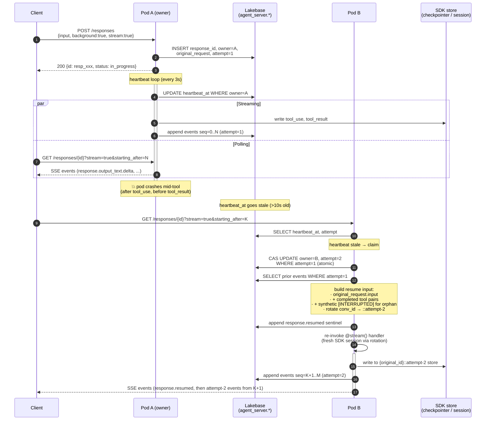
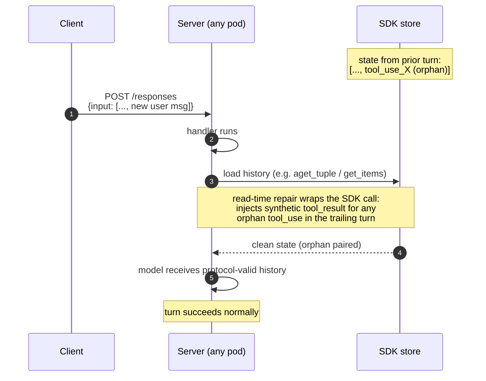
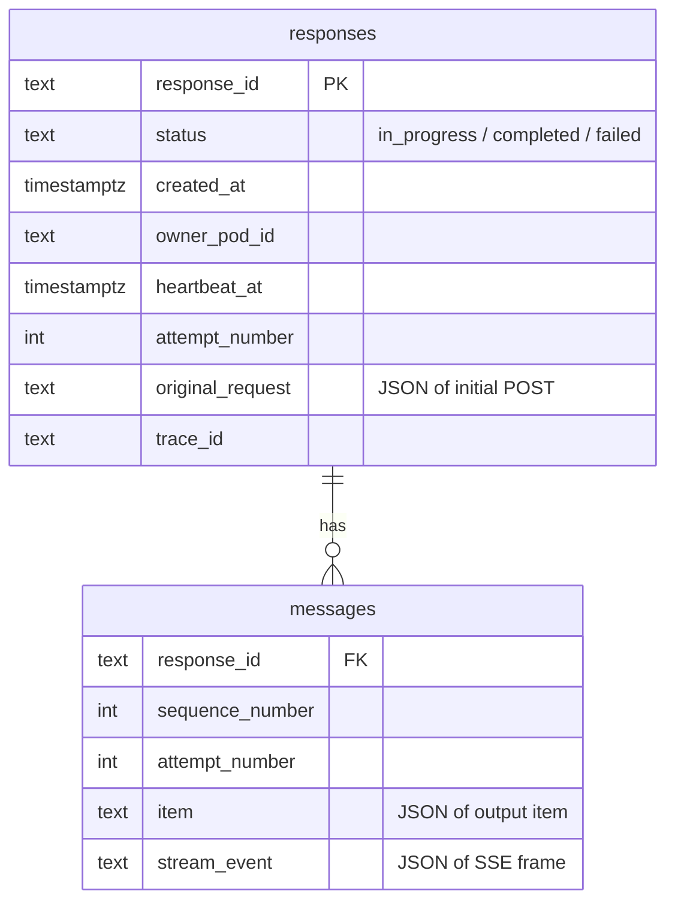
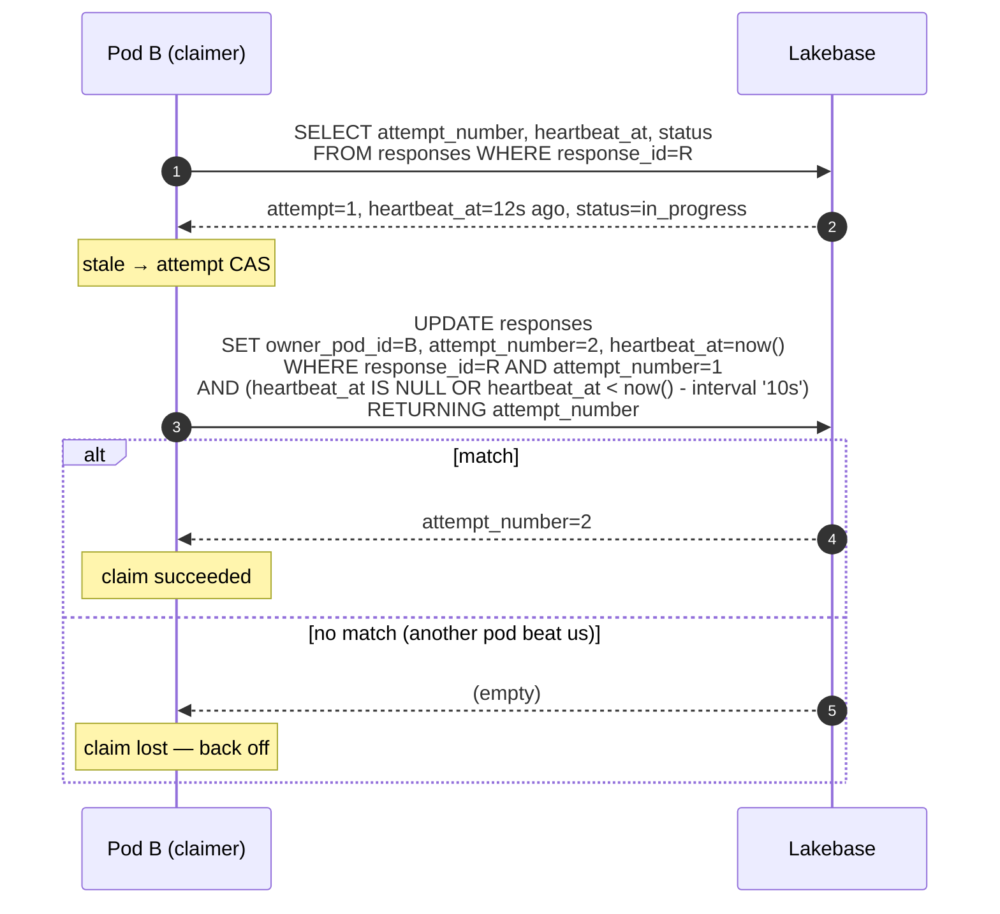

# LongRunningAgentServer

Durable, crash-resumable agent execution for MLflow `ResponsesAgent` handlers.

This document describes:
1. What `LongRunningAgentServer` does and the guarantees it gives callers ([§1](#1-what-this-module-does)).
2. The four customer journeys it covers, with sequence diagrams ([§2](#2-customer-journeys)).
3. The architecture: storage layout, claim mechanism, recovery, and stream resume ([§3](#3-architecture)).
4. Author-side requirements: what changes (and doesn't) when a handler opts into durable mode ([§4](#4-author-side-requirements)).
5. The interface today and how it's expected to evolve when [TaskFlow](https://github.com/databricks-eng/universe/tree/master/experimental/taskflow) lands ([§5](#5-future-direction-taskflow)).

## 1. What this module does

`LongRunningAgentServer` extends MLflow's `AgentServer` for `ResponsesAgent` handlers with three capabilities:

1. **Background execution.** A `POST /responses` request with `background: true` returns a `response_id` immediately; the agent loop runs detached from the HTTP connection. State persists to Lakebase Postgres.
2. **Streaming retrieval.** `GET /responses/{response_id}?stream=true&starting_after=N` replays events past sequence `N` and tails new ones until the run finishes. Reconnects without losing events.
3. **Crash-resumable execution.** If the pod running an agent loop dies, another pod atomically claims the run, replays prior tool/output state, and finishes the work. Tool results that completed before the crash are preserved.

Callers see one HTTP surface; the underlying SDK (LangGraph, OpenAI Agents, others) is opaque to the server.

### Guarantees

- **At-most-once durable claim.** Only one pod runs a given response at a time. The handoff uses an atomic CAS on `attempt_number`.
- **Append-only event log.** Every SSE frame is persisted to `agent_server.messages` keyed by `(response_id, attempt_number, sequence_number)`. Clients cursor-resume from `starting_after`.
- **Best-effort tool execution.** A tool call interrupted mid-flight may re-run on the resumed attempt. Idempotency is the tool author's responsibility.
- **No agent code changes required.** Templates that subclass `LongRunningAgentServer` keep using `@invoke()` / `@stream()` decorators. Repair logic lives below the handler boundary.

### Non-goals

- Cross-region failover. Pods are assumed to share one Lakebase.
- Tool-level checkpointing / exactly-once tool execution.
- A workflow DSL. Handlers are ordinary async generators / coroutines.

## 2. Customer journeys

### CUJ 1: Author writes a long-running agent

The author subclasses `LongRunningAgentServer` and registers `@invoke()` / `@stream()` handlers like a regular MLflow agent server. **No durability code in `agent.py`.**

```python
from databricks_ai_bridge.long_running import LongRunningAgentServer
from mlflow.genai.agent_server import invoke, stream

agent_server = LongRunningAgentServer(
    "ResponsesAgent",
    db_instance_name="my-lakebase-instance",
)

@stream()
async def stream_handler(request):
    # ordinary agent code: build messages, call SDK, yield events
    ...

@invoke()
async def invoke_handler(request):
    ...

app = agent_server.app
```

The agent author writes their handler exactly the same way they would for the non-durable `AgentServer`. `LongRunningAgentServer` adds the durable wiring transparently.

### CUJ 2: Pod crashes mid-tool, client polls

A client posts a long-running request, the owning pod dies mid-tool, another pod takes over, and the client gets the final output without restarting.



**What the client observes:** a single SSE stream that may pause briefly during the heartbeat-stale window (~10s by default), then resumes. The `response.resumed` sentinel marks the boundary between attempts so the UI can render appropriately (e.g., "reconnecting…" + a fresh attempt bubble).

**What the agent author observes:** their handler is invoked once for the original POST; a second time on resume. The second invocation's `request.input` contains the original input plus the carried-forward tool events plus a synthetic `[INTERRUPTED]` for any tool whose result didn't land. The handler doesn't have to know any of this.

### CUJ 3: Subsequent turn after a crashed turn

After a crash + resume, the next turn from the client lands on a fresh `POST /responses`. The SDK's storage (LangGraph checkpointer or OpenAI session) still contains the orphan `tool_use` from the crashed attempt because the SDK persisted it before the result landed. Without intervention, the next LLM call would be rejected by the provider's `tool_use → tool_result` pairing rule.



The repair wrappers are in `databricks-langchain.AsyncCheckpointSaver.aget_tuple` and `databricks-openai.AsyncDatabricksSession.get_items`. They're idempotent and no-op on clean state.

### CUJ 4: Multi-pod stale-claim contention

Two pods each see the same response in `in_progress` with a stale heartbeat. Only one wins the CAS.

```mermaid
sequenceDiagram
    autonumber
    participant B as Pod B
    participant DB as Lakebase
    participant C as Pod C

    Note over B,C: both pods see response in_progress, heartbeat stale
    par
        B->>DB: UPDATE responses SET owner=B, attempt=N+1<br/>WHERE response_id=R AND attempt=N
    and
        C->>DB: UPDATE responses SET owner=C, attempt=N+1<br/>WHERE response_id=R AND attempt=N
    end
    Note over DB: only one row matches; the other UPDATE returns 0 rows
    DB-->>B: RETURNING attempt_number=N+1
    DB-->>C: RETURNING (no row)
    Note over B: B wins, spawns resume handler
    Note over C: C aborts cleanly, returns to its retrieve loop
```

The `claim_stale_response` function (`repository.py`) executes a single `UPDATE … WHERE attempt_number = :current AND ((heartbeat_at IS NULL) OR (heartbeat_at < now() - interval))` with `RETURNING`. Postgres serializes the writes; only the pod whose `current` value was unmodified at commit time gets the `RETURNING` row.

## 3. Architecture

### 3.1 Storage layout

Two tables in the `agent_server` schema:



- `responses.attempt_number` is the CAS guard for claim atomicity.
- `messages.attempt_number` tags every event so retrieval can filter to the latest attempt's output (avoiding partial output from a crashed attempt leaking into the final response body).
- Schema migrations are idempotent (`ADD COLUMN IF NOT EXISTS`) so an existing deployment upgrades without downtime.

### 3.2 The four key flows

```mermaid
flowchart TD
    POST["POST /responses<br/>background=true"] --> CR[create_response<br/>store original_request]
    CR --> SPAWN[spawn @stream handler]
    SPAWN --> HB[heartbeat loop<br/>every 3s]
    SPAWN --> EMIT[append SSE events<br/>to messages table]
    EMIT --> DONE{handler<br/>exits?}
    DONE -- yes --> COMPLETE[update status=completed]
    DONE -- crash --> STALE[heartbeat stops<br/>row goes stale]

    GET["GET /responses/&#123;id&#125;<br/>?stream=true&starting_after=N"] --> CHECK[check heartbeat age]
    CHECK -->|fresh or terminal| READ[read events from messages<br/>where seq > N]
    CHECK -->|stale| CLAIM[CAS claim<br/>attempt += 1]
    CLAIM -->|won| BUILD[collect prior events<br/>build resume input<br/>rotate conv_id]
    CLAIM -->|lost| READ
    BUILD --> SPAWN
    READ --> STREAM[SSE stream to client]

    KILL["POST /_debug/kill_task/&#123;id&#125;<br/>(test-only)"] --> CANCEL[cancel asyncio task<br/>without status update]
    CANCEL --> STALE
```



### 3.3 Resume input construction

When a stale-claim CAS succeeds, the new owner builds the resume input from the prior attempt's emitted events:

```mermaid
flowchart LR
    PRIOR[prior attempt's events<br/>from messages table] --> WALK[_collect_prior_attempt_tool_events]
    WALK --> POOL[completed tool pairs<br/>function_call + function_call_output]
    WALK --> NARR[completed narrative<br/>output_item.done for messages]
    WALK --> PARTIAL[partial assistant text<br/>reassembled from deltas]

    POOL --> COMPOSE[compose: original_request.input<br/>+ tool pairs<br/>+ synthetic [INTERRUPTED] for orphan<br/>+ narrative<br/>+ partial]
    NARR --> COMPOSE
    PARTIAL --> COMPOSE

    ROT[_rotate_conversation_id<br/>::attempt-N suffix] --> SANITIZE
    COMPOSE --> SANITIZE[_sanitize_request_input<br/>pair orphan function_call ids]
    SANITIZE --> INVOKE[re-invoke @stream handler<br/>with rotated request]
```

Why the rotation: the SDK's storage may carry mid-turn state from the crashed attempt that's hard to repair without SDK-internals knowledge. Rotating to `{base}::attempt-N` opens a fresh thread/session for the resumed attempt; the structured input carries the prior work forward in a shape both LangGraph and OpenAI handle natively.

Why the sanitizer: the trailing assistant turn always has at least one orphan `function_call` (the one whose tool was interrupted). The sanitizer pairs it with a synthetic `[INTERRUPTED]` `function_call_output` so the next LLM call is protocol-valid.

### 3.4 Heartbeat and stale threshold

Defaults are tuned for a single Lakebase deployment with low-latency writes.

| Setting | Default | Rationale |
|---|---|---|
| `heartbeat_interval_seconds` | 3.0 | Frequent enough that short pauses (GC, tokio task waits) don't trip stale detection |
| `heartbeat_stale_threshold_seconds` | 10.0 | Three missed heartbeats = unambiguously dead. Validated stale > interval at startup. |
| `task_timeout_seconds` | 3600 | Hard ceiling. After this, a stuck `in_progress` row is force-failed regardless of heartbeat. |
| `poll_interval_seconds` | 1.0 | Stream-retrieve polls the messages table at this rate while waiting for new events. |

The stale threshold also applies as a grace period for newly-created responses that haven't written their first heartbeat yet — protects against an over-eager retrieve hijacking a still-starting handler.

### 3.5 Claim atomicity



Postgres row locking ensures only one of N concurrent UPDATEs matches, so at most one pod ends up owning a given resume.

## 4. Author-side requirements

### 4.1 Today

| Concern | Where it lives | Author-visible? |
|---|---|---|
| Heartbeat + claim | `LongRunningAgentServer` | No |
| Conversation_id rotation | `LongRunningAgentServer._rotate_conversation_id` | No |
| Resume input construction | `LongRunningAgentServer._collect_prior_attempt_tool_events` + sanitizer | No |
| Stream resume cursor | `LongRunningAgentServer._stream_retrieve` | No |
| Read-time repair on subsequent turns | `databricks-langchain.AsyncCheckpointSaver.aget_tuple` (wrap) / `databricks-openai.AsyncDatabricksSession.get_items` (wrap) | No — invisible inside the SDK adapters |
| Tool/SDK selection | `agent.py` | Yes (this is the author's actual code) |

The author's `agent.py` is unchanged from a non-durable agent. They construct an `AsyncCheckpointSaver` (LangGraph) or `AsyncDatabricksSession` (OpenAI) and use it normally. Durability fires below the SDK boundary.

### 4.2 Settings worth exposing to authors

- `db_instance_name` / `db_autoscaling_endpoint` / `db_project` + `db_branch` — Lakebase connection config.
- `heartbeat_interval_seconds` / `heartbeat_stale_threshold_seconds` — for tuning under heavy load.
- `task_timeout_seconds` — per-attempt ceiling.

Everything else is internal.

### 4.3 Settings authors should NOT need to override

- `auto_sanitize_input` is true by default and should stay that way for chat UIs.
- The synthetic `[INTERRUPTED]` text (`DEFAULT_SYNTHETIC_INTERRUPTED_OUTPUT` in `tool_repair.py`) is part of the durable contract; changing it is a product decision, not a per-template knob.

## 5. Future direction: TaskFlow

[TaskFlow](https://sourcegraph.prod.databricks-corp.com/databricks-eng/universe/-/tree/experimental/taskflow) is a Rust-core durable-task engine being built in `experimental/taskflow`. It provides exactly the primitives `LongRunningAgentServer` hand-rolls today (heartbeat, CAS claim, recovery worker, event log with stream resume) — but as a library with WAL-first durability and proactive (not lazy-on-GET) recovery.

When TaskFlow is production-ready, `LongRunningAgentServer` is expected to keep its **HTTP surface and author-visible API unchanged**, swapping only the engine internals.

### Mapping today → TaskFlow

```mermaid
flowchart LR
    subgraph TODAY[LongRunningAgentServer today]
        T1[create_response + asyncio.create_task]
        T2[_heartbeat async CM]
        T3[_try_claim_and_resume CAS]
        T4[_collect_prior_attempt_tool_events]
        T5[/responses/&#123;id&#125;?stream=true]
        T6[/_debug/kill_task]
    end

    subgraph TF[TaskFlow]
        F1[Taskflow.start name input user_id]
        F2[built-in executor heartbeat]
        F3[built-in recovery worker + claim_for_recovery]
        F4[TaskHandler.recover ctx previous_events]
        F5[Taskflow.subscribe key last_seq]
        F6[Taskflow.simulate_crash key]
    end

    T1 --> F1
    T2 --> F2
    T3 --> F3
    T4 --> F4
    T5 --> F5
    T6 --> F6
```

### What stays in `LongRunningAgentServer` after the swap

- `POST /responses` / `GET /responses/{id}` HTTP routes (and their schemas).
- The MLflow `@invoke()` / `@stream()` handler convention.
- `_rotate_conversation_id` — rotation is handler-policy, not engine-internals; lives in the adapter that bridges MLflow handlers to TaskFlow's `recover()`.
- `_inject_conversation_id` at POST time.
- Author-visible settings (db config, heartbeat tuning, task timeout).

### What gets deleted

- The hand-rolled heartbeat task and CAS claim CTE — replaced by TaskFlow's executor heartbeat + `claim_for_recovery`.
- The `_try_claim_and_resume` lazy-claim path — TaskFlow's recovery worker handles this proactively and across pods, fixing the documented "claim only fires on GET" limitation.
- The `agent_server.responses` + `agent_server.messages` schema — TaskFlow owns its storage layer.
- The stream-cursor logic in `_stream_retrieve` — `Taskflow.subscribe(key, last_seq)` is the cursor-based stream resume.

### What requires a small TaskFlow API addition

TaskFlow derives idempotency keys as `SHA256(name + canonical_input + user_id)`. The HTTP surface uses a server-generated `resp_{uuid}`. We've requested an `idempotency_key: Option<String>` parameter on `Taskflow.submit()` so we can keep the existing HTTP contract while submitting to TaskFlow. See [`engine.rs:317`](https://sourcegraph.prod.databricks-corp.com/databricks-eng/universe/-/blob/experimental/taskflow/engine/src/engine.rs?L317) for the current `generate_key` call site; the override would slot in there.

### Migration sequencing

1. Add `LongRunningAgentServer(backend="taskflow"|"builtin")` knob, default `"builtin"`. HTTP surface unchanged on either backend.
2. Port `agent-non-conversational` (the simplest template) to `backend="taskflow"`. Run the full crash-resume matrix.
3. Port the advanced templates. **Zero changes to `agent.py`** — the swap is the constructor argument.
4. Flip default to `"taskflow"`. Deprecate `"builtin"`.
5. Delete the heartbeat / claim / repository code. Big delete PR.

The point of the `LongRunningAgentServer` abstraction is exactly this kind of swap: callers should never have to care which engine is underneath.

---

## Quick reference

- **Code:** `src/databricks_ai_bridge/long_running/`
- **Tests:** `tests/databricks_ai_bridge/test_long_running_server.py`, `test_long_running_db.py`
- **Settings:** `LongRunningSettings` in `settings.py`
- **Model:** `Response` and `Message` in `models.py`
- **HTTP routes:** registered in `LongRunningAgentServer._setup_routes`
- **Read-time repair (LangGraph):** `databricks-langchain/checkpoint.py::_repair_loaded_checkpoint_tuple`
- **Read-time repair (OpenAI):** `databricks-openai/agents/session.py::AsyncDatabricksSession.get_items`
- **Shared sanitizer:** `tool_repair.py::sanitize_tool_items`
