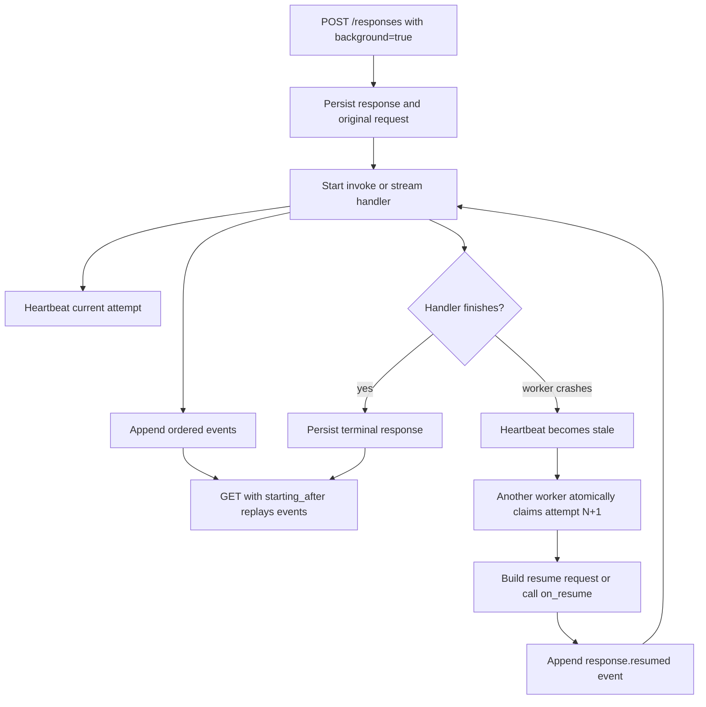

# LongRunningAgentServer

`LongRunningAgentServer` adds Lakebase-backed background execution, crash recovery,
result retrieval, and durable SSE replay to MLflow `ResponsesAgent` handlers.

## Author API

Authors register the same handlers they use with MLflow's `AgentServer`:

```python
from databricks_ai_bridge.long_running import LongRunningAgentServer, ResumeStrategy
from mlflow.genai.agent_server import invoke, stream

agent_server = LongRunningAgentServer(
    "ResponsesAgent",
    db_autoscaling_endpoint="projects/.../endpoints/...",
    resume_strategy=ResumeStrategy.AGENT_SESSION,
)


@invoke()
async def invoke_handler(request):
    ...


@stream()
async def stream_handler(request):
    ...


app = agent_server.app
```

A client starts durable work with `POST /responses` and `background: true`.
The server immediately returns a `response_id`. The client can then:

- poll with `GET /responses/{response_id}`;
- replay and tail SSE with
  `GET /responses/{response_id}?stream=true&starting_after=N`.

## Recovery Strategies

Heartbeat monitoring and stale-attempt claiming are always enabled for background
work. `resume_strategy` controls only how a restarted handler receives agent
context.

| Strategy | Recovery request | Agent session | Handler requirement |
| --- | --- | --- | --- |
| `ResumeStrategy.EVENT_LOG` | Appends prose containing the immediately previous attempt's durable events. | Rotates to `<session-key>::attempt-N`. | A registered `@stream()` handler is required. |
| `ResumeStrategy.AGENT_SESSION` | Replaces input with a fixed recovery prompt. | Reuses the same session key so the SDK reloads its transcript. | Uses the original request's invoke/stream handler mode. |

SSE event persistence and cursor replay are always enabled for both strategies.

### Event-log recovery

Event-log recovery is SDK-agnostic. It serializes the previous attempt's events
into a user message and asks the model to determine what completed and what
should be retried. The resumed attempt uses a fresh SDK session so it does not
inherit a partial tool call or checkpoint from the crashed attempt.

Because this strategy rotates the session key, a conversational client should
read `conversation_id` from the `response.resumed` SSE event and use it for
later turns.

### Agent-session recovery

Agent-session recovery delegates transcript restoration to the agent harness or
SDK. The request must resolve to the same persistent SDK session before and
after the crash. The runtime recognizes these request fields, in priority order:

1. `custom_inputs.thread_id`
2. `custom_inputs.session_id`
3. `context.conversation_id`

If none is present, the runtime logs a warning and injects the generated
`response_id` as `context.conversation_id`. This keeps execution working, but
the handler still must use that field when opening its SDK session.

A **session key** is the stable identifier the handler passes to its SDK session
or checkpointer. It is distinct from `response_id`, which identifies one
background Responses API operation. They share a value only when the runtime
uses `response_id` as the fallback session key.

## Resume Hook

Applications can override the stored-request transformation:

```python
from databricks_ai_bridge.long_running import ResumeContext, on_resume


@on_resume()
async def resume(request, context: ResumeContext):
    resumed = await context.default_resume_request(request)
    return resumed
```

The runtime calls `@on_resume()` only after a worker atomically claims a stale
attempt. It does not run for ordinary requests. The returned request then goes
through the same `@invoke()` or `@stream()` mode selected for that response.

`ResumeContext` exposes:

- `response_id`: the durable response being restarted;
- `attempt_number`: the newly claimed attempt;
- `previous_attempt_number`: the crashed attempt;
- `resume_strategy`: the configured strategy;
- `previous_attempt_events`: durable events from only the immediately previous
  attempt, not the SDK transcript;
- `default_resume_request()`: the built-in transformation for the configured
  strategy, useful when an override wants to delegate and then modify the result.

## Runtime Flow


```mermaid
flowchart TD
    A["POST /responses with background=true"] --> B["Persist response and original request"]
    B --> C["Start invoke or stream handler"]
    C --> D["Heartbeat current attempt"]
    C --> E["Append ordered events"]
    C --> F{"Handler finishes?"}
    F -->|"yes"| G["Persist terminal response"]
    F -->|"worker crashes"| H["Heartbeat becomes stale"]
    H --> I["Another worker atomically claims attempt N+1"]
    I --> J["Build resume request or call on_resume"]
    J --> K["Append response.resumed event"]
    K --> C
    E --> L["GET with starting_after replays events"]
    G --> L
```

Recovery restarts a handler; it does not resume a suspended Python coroutine.
A tool interrupted before its result is durable may run again. Tool authors are
responsible for idempotency.

The stale scanner recovers work proactively. A retrieve request also tries a
lazy claim, so reconnecting clients can trigger recovery immediately.

## Persistence

There are three logically separate stores. They may use the same Lakebase
database, but they have different owners and purposes.

| Store | Owner | Purpose |
| --- | --- | --- |
| Runtime durability | `LongRunningAgentServer` | Tracks response status, heartbeat, attempts, original request, handler mode, and terminal response. |
| Durable event log | `LongRunningAgentServer` | Stores ordered output items and SSE frames for replay. Event-log recovery also reads it. |
| Agent session store | Agent SDK or harness | Stores the logical conversation transcript used by agent-session recovery. |

The runtime creates two tables in schema `agent_server`.

### `agent_server.responses`

| Column | Purpose |
| --- | --- |
| `response_id` | Primary key returned to the client. |
| `status` | `in_progress`, `completed`, or `failed`. |
| `created_at` | Absolute timeout reference. |
| `heartbeat_at` | Last heartbeat from the current attempt. |
| `attempt_number` | Compare-and-swap guard for ownership. |
| `original_request` | Full initial Responses request as JSON. |
| `terminal_response` | Authoritative completed or failed Responses payload as JSON. |
| `is_streaming` | Whether recovery dispatches through `@stream()` or `@invoke()`. |
| `trace_id` | Optional MLflow trace identifier. |

### `agent_server.messages`

| Column | Purpose |
| --- | --- |
| `response_id` | Parent durable response. |
| `sequence_number` | Monotonic SSE replay cursor. |
| `attempt_number` | Attempt that emitted the row. |
| `item` | Optional serialized output item. |
| `stream_event` | Optional serialized SSE event. |

The agent SDK owns its own schema. For example,
`AsyncDatabricksSession` creates `agent_sessions` and `agent_messages`.
There is no foreign key between those tables and `agent_server`; the session key
inside `original_request` is the logical correlation.

## Claim and Ownership

A response row has no pod identifier. Ownership is implicit in
`attempt_number`:

1. The current worker heartbeats only while its expected attempt number still
   matches.
2. A contender claims stale work with one conditional
   `UPDATE ... SET attempt_number = attempt_number + 1 ... RETURNING`.
3. Exactly one contender receives a row from `RETURNING`.
4. A previous worker that is still alive loses its next heartbeat CAS and stops
   acting as owner.

Only the current attempt can write terminal status. This prevents a delayed
task from overwriting a later attempt's result.

## Handler Selection

- `EVENT_LOG` always runs background work through `@stream()`, even when the
  client requests `stream: false`. The client flag controls delivery; the
  stream handler supplies intermediate recovery events.
- `AGENT_SESSION` preserves the original execution mode. A streaming request
  resumes through `@stream()`; a polling request resumes through `@invoke()`.
- Foreground requests retain ordinary `AgentServer` behavior.

## Guarantees and Limits

- One worker wins each stale-attempt claim.
- Events are append-only and replayable by sequence number.
- The terminal response is stored independently of event reconstruction.
- `@on_resume()` is optional and runs once per successfully claimed attempt.
- Event-log recovery currently uses only the immediately previous attempt's
  events.
- Tool execution is at-least-once across a crash.
- Cross-region failover and exactly-once external side effects are out of scope.
- Background mode requires Lakebase. Foreground mode works without it.

## Settings

| Setting | Default | Purpose |
| --- | --- | --- |
| `task_timeout_seconds` | 3600 | Maximum response age before failure. |
| `poll_interval_seconds` | 1 | Event-log polling interval. |
| `heartbeat_interval_seconds` | 3 | Worker heartbeat cadence. |
| `heartbeat_stale_threshold_seconds` | 10 | Age at which another worker may claim an attempt. |
| `db_statement_timeout_ms` | 5000 | Postgres statement timeout. |
| `cleanup_timeout_seconds` | 7 | Cleanup budget after task failure. |

## Code Map

- HTTP and recovery orchestration: `server.py`
- `ResumeStrategy`, `ResumeContext`, and `@on_resume()`: `resume.py`
- Database lifecycle and migrations: `db.py`
- SQLAlchemy tables: `models.py`
- Durable queries and CAS claim: `repository.py`
- Runtime settings: `settings.py`
- Unit tests: `tests/databricks_ai_bridge/test_long_running_server.py` and
  `test_long_running_db.py`
